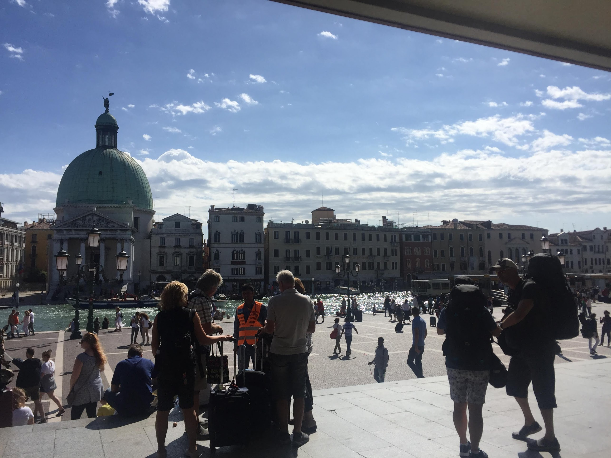

# 2018년 회고

2018년 회고록이다. 2018년은 회사밖에서 거의 대부분의 시간을 보냈다. 고독한 시간이었고 창업에 대해서도 꽤나 깊게 생갔했으며 엔지니어의 삶에 대해서도 고민했다.

기술적으론 프론트엔드는 접어두고 나머지 빈 스택과 결국 하나의 서비스를 관리 및 지속이 가능하게 돌릴 수 있는 스택을 쌓고자했다. 서버리스와 AWS의 완전 관리형 서비스들만으로 원하는 기술적 목표에 도달하기 위해서 노력했으며 엄청난 삽질끝에 결국 도달했다. 

금전적인 면을 완전히 외면할 수 없기에 나에게 1년이라는 시간을 할당했으나 심적인 압박을 견디는 것은 또 다른 이슈였고 이 모두가 다 경험이었다. 이 와중에 다녀온 이탈리아 여행에서 예술가들에 빗대어 엔지니어의 삶에 대해 더 깊게 생각할 수 있었다.

## 퇴사

2017년에 이직을 할까 퇴사를 할까 고민했었다. 몇 군데 면접을 보고 괜찮은 오퍼까지 받은 상황까지 간 상황에서 외국에서 일을 마치고 2018년 복귀하는 친구에 맞춰서 퇴사하기로 했다. 때문에 초반에 제시한 연봉을 한번에 제시하지 않기를 바랬는데 제시한 연봉이 그대로 받아들여진다면

> 내가 제시한거니까 입사해야겠다.

생각했는데 역시나 협상을 위해 다른제안에 스톡옵션 뭐 이런류의 제안이 오면서 친구와 함께 하기로하고 2018년 3월까지 회사에 있었다.

퇴사시점은 입사한지 1년 11개월이라는 애매한 시점이었다. 때문에 휴가 문제나 이런게 좀 복잡했던 것 같고 추후 다시 구직을 할 때도 연봉등에 패널티가 걸리겠구나 싶었지만 시간과 명분😶이 더 중요하므로 친구가 귀국하는 그날 퇴사했다.

퇴사이후로는 을지로 위워크에서 11월까지 일하고 그 이후는 추워서 집에서 업무를 진행했다.

## 블로그

퇴사도 했겠다. 넘치는 에너지와 이제껏 삽질해온 컨텐츠 몇개를 공유하고자 몇개 글을 써서 공유했다.

카테고리는 기술적인 것 부터 개인 적인 공부까지 작성했다.

- 타입스크립트
- 모노레포
- 책 후기(기술관련, 창업관련)
- 라이브러리(ramda, next.js)
- 자체 제작 후기
- aws(appsync, iam, dynamodb 등)

함께 일하는 후배가 이직을 한다길래 경험 공유도 해줄겸 해서 이런 글도 공개적으로 작성했다. 추가적으로 퇴사 후 프로젝트를 진행함에 있어 필요한 툴들이 있어서 이런 것들도 초반에는 좀 공유를 했다.

그리고 개인적으로 필요한 것들을 npm에 배포하면서 몇가지 공유를 했다.

## 창업지원시도

상반기 친구와의 프로젝트를 접고 서로 원하는 바가 달라 각자도생을 결정하고 창업지원을 하기로했다.

최대 지원 금액이 1억이었는데 사실 이 돈을 국가에서 지원하는 것 자체가 엄청난 거긴하지만 이를 가지고 뭘 하기엔 자영업이 아닌 이상 IT기반의 B2C 서비스를 하기에는 턱없이 모자르다고 생각했다. 그렇다고 투자를 받으면서 사업을 펼치는것이 또 내가 원하는 것인가에 대해 생각이 많았다. 고민이 많았지만 트리거가있어야 또 새로운 삶에 도전할 수 있으므로 강제트리거의 주사위를 던지기로했다.

결과적으로 서류합격 후 발표까지 했는데 결국 떨어졌다.

난 합격이건 불합격이건 간에 주어진 상황을 받아들이고 다시 전략을 수립하는(합리화와는 전혀 다르다) 타입인데 사실 합격이되도 스스로에게 준비가 되었는가에 대한 부담이 있었다.

난 회사 프로젝트에서 개인적으로 여러가지 시도를 다 해보고 내 코드가 드랍되는 것을 가장 선호했는데 이유는 기술적인 시도는 다해보고 책임에서 자유로워서다. 마찬가지의 이유로 아이디어를 글로 풀어낼 수 있을 정도로 깊게 고도화 시키고 이런 저런 고민을 깊이 해볼 수 있는 시간을 갖게되서 좋았다.

발표 울렁증이 심하게 있는데 여튼 이떄 반응도 상당히 좋아서 5분 발표 5분 질의임에도 불구하고 한분이 상당히 깊은 관심을 보이셔서 5분 발표에 질의 시간이 10분을 넘겨서 심사관중 한분에게 시간이 너무지체가 되서 여기까지 하자는 말로 무리가 됐다. 때문에 합격을 예상했는데 결과적으론 떨어졌다. 5분의 심사관중 한분하고만 거의 10분을 다 썼는데 나머지 분들이 관심이 없다는게 결국 불합격으로 이어졌다. 다소 IT에 대한 이해를 요구하고 있었는데 이 부분이 걸림돌이 되는 것으로 생각된다.

이게 불합격 한 이후로 바로 두달 뒤부터 원티드와 리멤버에서 같은 방식의 서비스를 내게된다. 😑 난 이런 경우가 경험상 많았는데 이 부분은 내가 상황을 기업만큼이나 관심을 가지고 잘 봤다는 것이므로 좋게 받아들있다.

이 아이디어에 대한 소개는 별도의 글을 통해서 풀어보고자 한다. 현재 이 글이 퍼플리싱되는 구깃이 이 아이디어의 프로토타입과 맞닿아있다.

---

## 일본, 이탈리아 여행

창업지원시도 자체가 생각보다 시간과 에너지 소모가 컸고 항상 합격을 대비하느라 스타트업 관련 경영 서적, 그리고 프로토타입 구현을 하며 지내니 8월이 됐다.

여행을 즐기는 타입은 아닌데 너무 빡빡하게 사는 것 같아서(난 주 7일을 모두 코딩으로 지낸다), 또 백수다 보니 주변에서 함께 여행을 가자해서 힐링도 할겸 일본과 이탈리아를 다녀왔다. 각각 8월말과 9월 말이었다. 다녀온 직후 홋카이도에 지진과 베니스에 50년만의 홍수가 났다. 독일 호텔에서 불났던게 우연이 아니었건가...☠️

### 일본

일본은 도심이 아닌 홋카이도를 다녀왔는데 자연경관이 너무 좋아서 좋았다. 조용한 도심 느낌으로 기간도 짧아서 정말 힐링이랄까? 여행으로 해외를 나가본 것도 처음이라 여행이이 그냥 투어 불러서 따라다니는 것인지를 처음알았다. 여행도 역시 편하게 되어있다는 소중한 경험을 얻었다.

### 이탈리아

이탈리아는 다소 충격적이었는데 처음 뭣도 모르고 조각상이 보여서 사진을 막 찍었는데 그런건 그냥 동네 전체 널려있었다. 감상은 일기장에쓰고 다소 좀 느끼는 부분이 있었는데 미켈란젤로등의 천재들이 있지만 르네상스가 열리는데 이들이 발현할 수 있는 자본, 후원 시스템이 존재했다는 점이었다.

이 부분에 관심을 둔 이유는 이유는 오프소스 생태계와 비슷해서다. 패트론과 베이커 등이 있는데 사실 이정도로는 생업을 해결하기 쉽지 않으며 월급 수준을 상회하기 힘들다. 이 말은 풀타임 오프소서러가 되기 힘들다는 말이고 이는 비즈니스를 스스로 해결해내지 못하면 오픈소스가 훌륭한 레벨의 관리(maintain)를 지탱하기 힘들다는 말이다.

외국에서는 가끔 오픈소스를 후원하는 기업이 있는 걸 본적이 있는데 국내 기업에선 아직 보지 못한 것 같아. 아쉬운 부분이다. 아마도 창업자 레벨에서 IT에 대한 깊은 이해를 기반으로 성공한 기업이 별로 없기 때문이 아닐까 한다.

---

이런 저런 이유로 꽤나 큰 규모를 갖춘 조직안에서 프로젝트 조직 소속이 아닌 개발자(일정 쪼임에서 자유로운)만이 오픈소스 메인테이너로서 활동이 가능하지 않을까 싶다. 

## 🤖 구깃

동일한 기술적인 이슈(aws 및 타 서비스 인증 및 디비, serverless SEO)로 두번이나 프로젝트가 고지에서 미끄러졌는데 그때 마다 이름이 버려지고 결국 구깃이 남아 이 두가지 컨셉을 합치게 됐다. 

대단히 오랜시간이 들어갔다 스트레스를 엄청나게 받았는데 뚫어내야하는 길이 있고, 기술적인 목표를 포기하지 않기 위해 엄청난 시간을 소요했다. 기술 선택과 원하는 시나리오를 원하는 방식으로 실행하기 위해 여러 삽질을 하는데 10개의 길이있을 때 10번을 모두 시도하고 나서야 답을 찾는 최악의 경우가 반복되서 상당히 에너지 소모가 컸다.

모놀리딕으로 구현하고 익스프레스 모든 데이터를 관리하는 방식으로 가면 속도가 엄청났을텐데 서버리스를 추구하면서 각종 서비스를 함께 이용하는게 많은 부분을 대단히 어렵게 만들었다. 성숙도가 떨어지는 AWS 내에서의 서비스들도 있어 결국 삽질은 다하고 백하는 경우도 존재했다.

프로젝트를 진행함에서 있어서 해결하지 않고서는 진행이 불가능한 키 팩터가 몇개 있는데 이런 점들을 고민하고 해결하는데 매우 많은 시간이 소요됐다. 내가 말하는 키팩터는 해결하지 않고서는 진행이 불가능한 것들인데 대충 아래와 같다.

- URI 정의 관련
- 인증 관련
- 쿼리 요구사항

URI 정의 관련해서는 대표적으로 **다국어** 지원이 있다. URI 정의는 SEO와 연동되며 깨진 링크는 누구도 원하지 않기 때문에 정의하기가 매우 어렵다.

인증 관련해서는 어떤 방식으로 인증하는가를 결정해야하는데 이 부분 바꾸기가 매우 어려운 부분이며 각종 서비스들과의 연동 범위에 대해서 고민해야하는데 인증 시점에 필요한 유저 정보가 없는 등, 마이크로 서비스로의 구현이 특히 더 어려웠다. 또 지원하는 서비스들간에 충돌이 있어 매우 피곤했다.

다이나모디비는 NoSQL의 한종류로 조인이 없이 데이터를 저장하는데 타 디비와는 달리 쿼리 제약조건이 강해서 데이터를 뽑아내기가 어렵게 되어 있어 결국 저장시점에 데이터를 잘 저장해야하는데 추후에 데이터를 못 뽑을 수 있다는 압박은 엄청난 부담으로 진행하기가 쉽지않았다.

결국 지금 구깃에 이 글이 올라갈 예정이다. 구깃에 대한 스토리(정말 아팠던)와 이야기는 따로 글을 올리기로한다.

### 😈 다이나몬과 다이나리

그 중 재밌는게 다이나몬인데 다이나모 디비를 쓰다보니 로컬 개발환경이 약해서 이걸 그냥 테이블로 보는건 있어야하지 않겠나라는 생각으로 **디비에 대해 모르는 상태로** 그냥 바로 찍어냈다. 퇴사한지 한달즈음 되는 시점이라 넘치는 에너지를 가지고 1주일에 프로토타입을 찍어냈다. 만들다보니 일렉트론이라 이런 것들에 대해 기술적인 시도를 해보고 싶어서 아래 세가지를 시도하면서 

- 타입스크립트
- next.js
- 일렉트론

일렉트론을 적용하게 되면서 UI 프레임웍을 좀 **앱** 스러운 것으로 만들고자 했고 빌드를 해서 배포를 했다. 하면서 유튜브 영상도 찍고 블로그에 글도 함께서 공유를 했다. 이후 제프 형의 트위터를 타면서 갑자기 스타가 찍히게 된다.  사실 당장은 그 다지 로우별로 데이터만 보면 되기에 만들어놓다가 구깃을 만들면서 좀 더 고도화를 시켰다.

후반에 구깃을 만들면서 10월 즈음 본격적으로 다이나모 로컬 환경이 필요해졌는데 이때 빠른 개발을 위해 일렉트론을 버리고 `next.js` + `websocket` 로 리펙토링을 하고 로컬 환경에서의 `DynamoDB Stream` 피처까지 지원했다. **프로덕션 에러로 로컬에서 빌드시에만 사용할 수 있다.** 

다이나모디비 관련 툴링도 대단히 부족해서 [다이나리(dynale)](https://github.com/deptno/dynalee) 라는 라이브러리도 만들면서 진행을 했다. 다이나모디비에 대해서 엄청나게 공부를 했는데 몇가지는 **NoSQL** 에 관련된 것이 아닌 것도 있다. 디비에 대한 경험이 거진 없는 내게 엄청난 고민을 안긴 두가지 빅 이슈는 이런 것이었다.

- NoSQL 조인이 없는 구조기 때문에 쿼리를 먼저 뽑아야한다. 이는 요구상의 선정의를 필요로 한다.
- 검색에 대한 제약 조건이 키내에서만 가능하기 때문에 매우 제한된다.

이 두 가지가 서로 시너지를 내서 더욱더 어렵게 만드는데 메인 파트가 아니다 보니 더 움직이기가 쉽지 않았다. 2가지는 한마디로 요약하면 대단히 공포스러운 한마디로 정의되는데 이런 내용이다.

>  선정의를 하는데 검색에 대한 제약조건이 강하므로 어떻게던 쌓아놓고 비효율적으로라도 데이터를 뽑아낼 수 있는 RDB와는 반대로 뽑아낼 수 자체가 없을 수 있다.

게다가 문서는 어플리케이션당 하나의 테이블을 베스트 프렉티스로 이야기하고 있는데 `amplify cli` 등에서 지원하는 `appsync` 와의 콜라보등은 모델당 테이블을 생성하고 있다. 내가 봤을때는 단순히 `amplify` 팀 조차도 `dynamodb` 에 대한 깊은 이해가 없는 것으로 보인다. RDB 다루듯 테이블 당 모델 디자인을 하고 있다. 대부분의 라이브러리도 그런 식으로 구현되어 있어 **DynamoDB Way** 에 대한 이해가 없다고 생각하고 시간도 촉박한데  [다이나리](https://github.com/deptno/dynalee) 를 구현했다.

그리고 다이나몬에 다이나리를 심었지만 사실상 로컬에서는 스캔 기능만을 사용하므로 더는 구현을 안했다.

## 입사 제안, 강의 제안, 프로젝트 제안

후반엔 창업지원 도전과 구깃에 쫒겨 글을 거의 못 썼는데 글을 첫 공개하기 시작한 4월 시점으로 평균 월 하나정도의 제안을 받았다.

결론적으로 응한 제안은 하나도 없다. 1인 1서비스의 시대를 준비하기 위한 스택을 쌓기 위해 나온 것이므로 일단 그것을 해야했는데 가끔 좋은 제안이 오면 고민하기도 했다. 선택의 폭이 존재하면 고민이 존재하고 고민이 있으면 마음이 피곤하다.

강의 제안같은 경우는 수입이 없으니 용돈도 되고 개인 프로젝트 진행과 병행이 될 수 있을 것 같아 생각을 해봤지만, 녹화등을 해본일이 없고, 결국 강의 자체보다는 커리큘럼 짜다가 시간이 많이 소요될 것 같아 거절했다.

프로젝트 제안 같은 경우는 매우 의외였는데 내가 프리랜서가 아닌 그냥 내일에 내 공부만 내 돈쓰면서 하고 있는 사람인데 이런 것도 블로그가 소스일까? 

## 그래서 올해는 목표가?

> 프로젝트는 미친듯이 달려서 두달안에 프로덕션 공개가 가능한 프로토타입을 만들 수 있어야한다. -이봉-

이게 목표였다. 이 능력. 왜 두달이냐, 경험상이다. 타임 투 마켓 도 끼워 맞추면 맞는 말일테다 실제로 지금은 주기가 너무 빨라 두달이면 다른 아이템이 보이게 된다. 정리해보겠다.

- 타임 투 마켓. 두달이 지나면 현재의 아이디어에서 나 조차도 관심이 멀어지게 될 가능성이 있다.
- 체력적으로 지치게된다. 지친 후에는 늘어지게되며 프론트, 백을 번갈아 일하다보면 뭐했었는지 기억도 안난다.
- 아이디어는 많다. 구현할 실력만이 필요하다. 기회는 그렇게 잡는 거라는 개인적인 철학.
- 나에게 있어서 개인 프로젝트는 내가 놀 놀이터를 자신이 만드는 개념이며 일종의 팔지않는 키털트 템과 비슷하다.
- 서버리스가 득세하는 지금이 시작시기다. 스케일링과 트레픽으로 자유롭다면 1인도 안정적인 서비스를 할 수 있다.
- 회사 외부에서 하고 싶은 업무의 기회 창출이 가능하다. 밥벌이 기술에 충실하면서도 기술의 폭을 계속 넓혀갈 수 있다.

올해 `php` 베이스의 친구와 초반에 3개월을 함께하면서 시작을 했는데 업체가 API가 너무 불안정하고 변경이 잦아 결국 3개월만에 프로젝트를 드랍하고 각자도생의 길을 가기로 했다. 이 또한 매우 소중한 경험이었다.

커뮤니케이션은 끝까지 진행하면 서로 생각이 다른 경우가 많다. 때문에 논쟁이 없다는 건 사실은 끝까지 대화를 하지 않았을 가능성이 있다. 회사에선 이렇게 해도 넘어갈 수 있지만 퇴사를 하는 순간 벌수 있었던 돈들이 쓰는 돈을 더해 마이너스로 들어가게 되며 사실상 셀프 고용으로 자신의 가치를 스스로가 돈을 주고 사는 형태가 된다. 때문에 더 열의를 가지고 움직일 수 밖에 없다. 이런 상황자체가 자신 채찍질하게 되며 더 발전을 시키는 강제트리거가 된다. 이런 비싼 시간을 원하지 않는 것을 하면서 보낼 시간은 없다. 때문에 사실은 누군가와 **진심으로 열의를 가지고** 함께 하는 것이 매우 어렵다.  때문에 두달안에 서비스는 **혼자** 올릴 수 있어야 했다.

## 이루었나?

아직 모른다. 이룬 것 같기도하다. 단지 지금은 다소 지쳐있다는 점.

구깃은 어렵게 만들어 졌다. 로컬에서 익스프레스 띄워서 패스포트로 인증을 구현하고 디비 인스턴스 띄워서 구현한 것이 아니다. 

구깃은 모든 인프라를 클라우드에 의존하면서 비용효율적으로 아무런 서버없이 만들어졌다. 때문에 스케일링이나 이런 제어가 필요 없는 구조로 만들어졌으며 그냥 트래픽만큼 비용을 내면 굴러가도록 구현했다.

대충 올해 아래와 같은 경험과 툴을 가지고 간다.

- 인프라에 대한 스택은 모두 테라폼으로 관리되어 코드로 기억되어 있다. 때문에 그냥 복사해서 실행하면 스택이 펼쳐진다.
- 다이나몬, 스트림을 포함한 모든 로컬 환경을 만들었다. 이제는 빠른 개발이 가능하다.
- 다이나리, 코드레벨에서 완전한 타입스크립트가 지원되는 라이브러리가 있음로 안전하게 코딩할 수 있다.
- 매우 어려웠던 다이나모 디비에 대한 이해
- 인증모듈, 어렵사리(삽질을 한달 넘게 시도하다가 기능을 드랍했다.) 얻은 순정모듈이다.
- 서버리스 SEO, 서버리스 환경에서의 다이나믹 SEO 처리
- Functional CSS 를 통한 고속 프론트엔드 개발
- 서버리스와 프론트엔드, 테라폼, 공용 패키지까지 함께 있는 모노레포의 구성
- GraphQL과 `codegen` 을 통한 타입스크립트 지원을 통한 타입 및 문서 지원

올해의 목표는 구깃이 아니다. 구깃을 구현하면 내 무기들을 검증하고 결국에 구깃까지 얻어간다.

### 아직 가져가야할 몇 가지가 있을지 모르겠다.

뭔가를 만들고 나서 불안해 하면 안되는데 데이터를 뽑는 시점이 아닌 저장시점에 결정해야한것은 철학적으로는 이해하나 유연성이 매우 떨어지기 때문에 해결할 수 없는 문제를 만날 가능성이 있다는 것이 마음을 어둡게 한다. 다이나모로 전체 디비를 처리하는 것은 무리일지 모른다 결국 완전 서버리스는 무리일 수 있고 고집하지 말아야 할 지도 모른다. 서버를 띄워 RDB를 올려야할지도 모른다. 그리고 어차피 풀텍스트 서치를 지원하려면 엘라스틱는 가야하는 걸지도?

아직 미디움의 글들도 다 옮기지 못한 상태인데 너무 늦어 잊기 전에 회고록을 남긴다. 정말 많이 지우고 간결하게 기록만 남긴 느낌으로 썼는데도 매우 길다. 한일이 많았으리라. 🤗