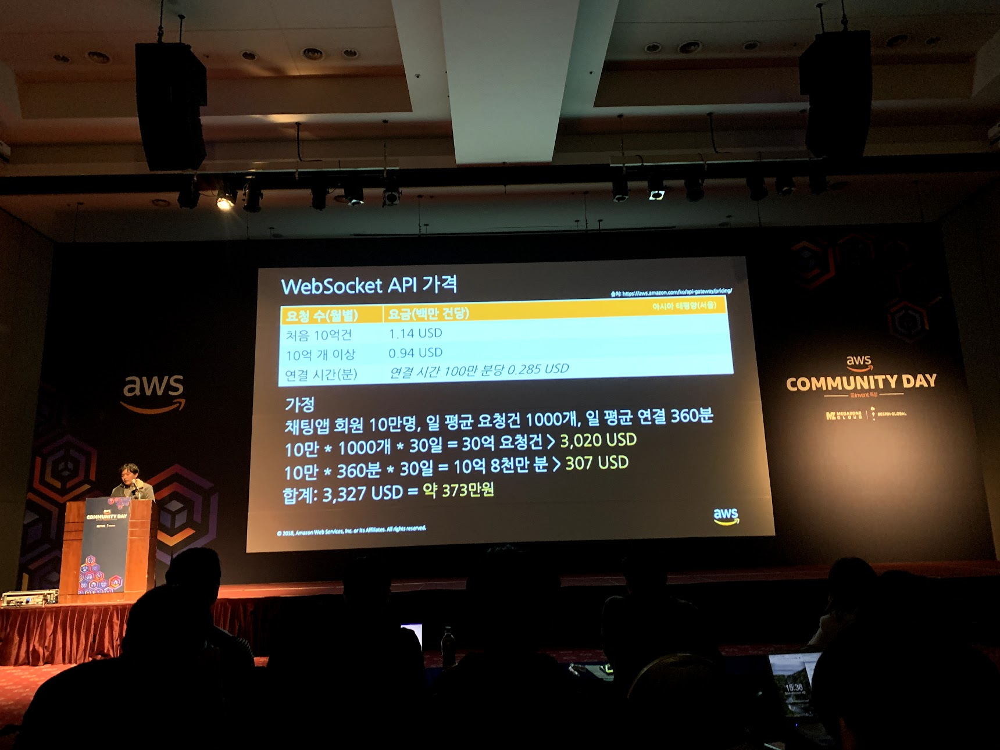

> 추후 다시 보기 위한 개인 정리

## 키노트

,.안나푸르나 인수, AWS는 이제 칩도 만들어서 직접 인스턴스 제공...

마이크로 서비스 -> 서비스 메시 이동 트렌드, 쿠베 기반의 모니터링

Serverless Application Repository + Nested Application(서버리스 앱 컴포지션) + ALB Support for Lambda

Step Function 을 통한 서버리스 워크플로 제어

## 참여 세션

- 14:30 - 15:00 - [데이터베이스] Amazon DynamoDB 신기능 - 온디멘드 트랜잭션 - 윤병호(AWSKRUG)
- 15:00 - 15:30 - [데이터베이스] Amazon Timestream -  시계열 데이터 전용 데이터베이스 소개 - 변규현(모빌리스트)
- 16:00 - 16:30 - [서버리스] Amazon API Gateway와 Lambda 함수 기반 Websocket 앱 구현하기 - 권정빈(AWSKRUG)
- 16:30 - 17:00 - [서버리스] Service Mesh, 좀 더 쉽게 - AWS App mesh - 안주은(My Music Taste)
- 17:00 - 17:30 - [데이터베이스] Lake Formation, 데이터레이크 관리와 운영을 하나로 - 이재성(플레이오토)

## Amazon DynamoDB 신기능 - 온디멘드 트랜잭션

### 온디맨드 용량 방식

기존에는 프로비저닝을 해야했는데 이 부분을 자동으로 해준다는 것과 쓰로틀이 존재하지 않는다.

Provisioned / Auto-scale / On-demand 3가지 방식이 있는데 요약하자면

프로비전은 정해 놓은(예약), 오토 스케일은 프로비전의 값을 조정한다는 개념이며, 온디맨드는 사용한만큼 낸다는 개념이다. 오토 스케일은 스케일시에 지연시간이 존재한다.

⚠️ 경험상 `terraform` 의 `worspace` 를 통해서 프로비전과 온디맨드는 전환 불가능하다 따로 선언해야한다.

#### 비용(서울 리전)

$1.3556, 쓰기 요청 100만 개당

$0.2727, 읽기 요청 100만 개당

이 가격들은 프로비저닝보다는 꽤나(?) 비싸다.

### 트렌잭션 지원

다이나모디비의 트랙잭션에는 아래 다섯가지가 없어서 좋다.

- 데드락

- 긴 트랙잭션 시간

- 열린 트랙잭션

- 관리되지 않은 동시성

- DB의 괴로움

### API

`TransactWriteItems`- 10개까지, 조건이 맞을때만 쓴다.

`TransactGetItems` - 10개까지

트랜잭션 API를 통해서 ACID 지원이 가능하다

### 트랜잭션이 실패하는 경우

#### 아이템 단위로 실패

- 사전 조건 실패
- 읽기/쓰기 용량 부족
- 트랜잭션 충돌

#### 다른 이유

- 트랜잭션 진행 중

- 서비스 에러

- 잘못 구성된 요청

- 퍼미션

### 비용

트랜잭션은 비트랜잭션에 비해 2배의 일을 한다. 때문에 2배로 읽기/쓰기의 용량이 사용된다.

## Amazon Timestream -  시계열 데이터 전용 데이터베이스 소개

신청해서 사용이 가능한 것으로 아는데(신청했는데 답이 없는 중) 발표는 소개 수준에서 진행되었다. 30분 세션이지만 15분만에 종료되었다.

Insert와 Read에 퍼포먼스를 집중, 시간과 하나이상의 항목이 키값이 된다. RDB 대비 1000배의 쿼리속도 1/10의 가격으로 사용이 가능하다.  데이터의 저장 스토리지를 메모리, 마그네틱, SSD로 선택가능하다. **서버리스** 다.

### 사용처

- 모니터링(대시보드)
- IoT 센서
- 이런 데이터를 기반으로 머신러닝 -> 예층

### 가격

스캔, 저장장치, 데이터 전송에 대한 비용이 존재한다. 백만당 $0.50, 1TB 스캔당 $10, 스토리지 종류별로 가격이 다르다.

데이터 In은 비용이 없으나 밖으로 나올때 가격을 물게된다.

ERD, DDL, DML

## Amazon API Gateway와 Lambda 함수 기반 Websocket 앱 구현하기

이번 세션도 15분 정도 진행되었으며 서버리스의 설명에 5분 가량이 소요된 점이 아쉽다. 코드를 볼 수 있었으면 좋겠지만 소스는 발표자료를 공유하면서 공유되는 것으로하고 데모 시연이 있었다.

API 게이트웨이를 통해 지원된다. 세션에서 들은 내용은 이해하기로는 커넥션 ID를 다이나모디비를 통해 직접 매니징 해야하는 것으로 보인다.

### 비용

연결 시간 + 메시지 전송 수으로 개산된다. 100만 분당 $0.285 가 부과되며 메시지당 과금은 처음 10억건 $1.14, 10억 개 이상 $0.94가 과금된다.

## Service Mesh, 좀 더 쉽게 - AWS App mesh

마이크로서비스의 인터 커뮤니케이션을 도와주는 목적이다.

중간에 딴 생각하느라 놓쳤는데 결론적으로는 컨테이너 기반의 마이크로서비스를 운영하는데 있어서 라우팅을 프록시(가상화) 하여 논리적으로 여러개의 컨테이너와 로드 밸런서를 붙이는 등의 관리를 할 수 있는 것으로 보인다.

딱히 다커 기반의 마이크로서비스에 중점을 두고 온 것이 아닌지라 중간 중간 정신이 비었다. 생각해보니 그래프 디비를 듣는게 좀 더 상황에 맞았을 거 같다.

## Lake Formation, 데이터레이크 관리와 운영을 하나로

### Data Lake 란 무엇인가?

Data warehouse 의 다음세대.

#### 데이터들

파일, 데이터베이스, 스트리밍 데이터(위성, 클릭 스트림)

RDBMS -> DW 로 몰아서 데이터를 뽑아낸다.(실서버에 영향이 가면안되기 때문에)

비정형 데이터 데이터가 정형 데이터대비 성장하고 있다.

#### 데이터 인프라의 요구사항

- Secure
- Real time
- Flexible(데이터 포맷)
- Scalable

DW 만으로는 부족하다 때문에 Data Lake의 등장, 프로비저닝(비용) 이슈

### 기존의 빅데이터 분석 시스템

하둡,

### 왜 클라우드에서 Data Lake를 해야하는가?

사실 이 세션이 대단히 중요했는데 나의 지식 부족으로 완전히 알아듣지 못했다. 현재 다이나모디비로 서비스를 구축하면서 느낀점이 통계에 대한 부담이 있는데 이를 중복저장하는 방식이 아닌 결국 데이터 중복 저장으로 처리해야한다는 생각을 하게되었고 그 개념이 데이터레이크와 비슷하다는 생각에 이르렀다.

> 일단 발표 내용을 요약해본다.

- 강한 내구성

- 보관 옵션에 따른 비용 효율성(99.99999% 에서 99%로 떨어뜨리면 비용이 50% 정도 감소)
- S3 Select, S3에 직접 질의
- AWS 연계성

EMR이 EC2기반이라 비용옵션(스팟이 좋다.) 이 좋다.

#### 스토리지 연계성

EMRFS을 통해 S3를 스토리지로 마운팅 하는 개념으로 보임

Redshift Spectrum 은 AWS DW 인데 S3를 스토리지로 사용 가능

Athena를 통해 S3 쿼리가 가능(S3 Select 는 다른 개념일 수 도 있겠다.)

#### AWS Glue

ETL 개념(ETL을 모름)인데 데이터 변형 서비스, Catalog와 함쳐서 아파치 스파크의 서버리스 서비스라고 보면된다.

카탈로그나 ETL을 글루를 통해 잘못쓰면 비용 폭탄 맞음(EC2 기반이 아니라서)

#### Data movement

키네시스, 파이어호스 등으로 S3로 옮기는 것 고려

### AWS Lake Formation 이란 무엇인가?

듣기만해도 복잡한 위의 것들을 해결하기 위한 솔루션, 글루등이 내부적으로 쓰임(아까 말했던 비용 비효율), 그런데 추가적인 Lake Formation 자체기능도 존재, 유연성이 떨어질 위험은 있음.

1. 데이터를 삽입(예제는 RDB)

2. 접근제어
3. 아테나 등을 통해 쿼리

## 후기

세션당 30분인데 어떤 발표는 실제 발표시간이 10분남짓이라는건 꽤나 아쉬운 부분이 있었다. 웹사이트의 소개뿐인 세션은 공허하다. 짧은 세션이라도 데모가 있으면 와닿는 점이 많았으며 소개 뿐일지라도 실 유저가 어떤점을 기다려왔는지를 이해하고 발표하는 세션은 나름의 갈증을 해소해줬다.

가장 키포인트는 Lake Formation 이었는데 그 자체보다는 데이터 레이크에 대한 개념이 내가 원하는 것이 맞는지에 대한 점을 맞춰볼 수 있어 좋았고 결국 데이터 트랜스퍼()