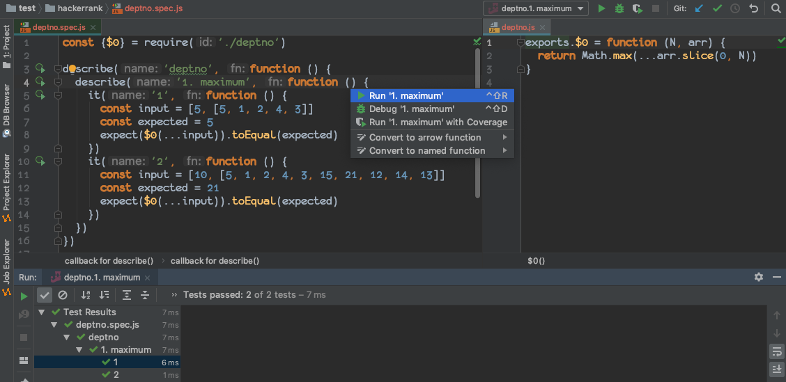

온라인 코딩 테스트를 위한 로컬 개발 환경, 코딩 테스트시 알아 둘 점


## 로컬 개발 환경

로컬 개발 환경을 구성하면 빼어난 장점이 자신이 매번 코딩 하던 환경 그대로 코드를 작성할 수 있다는 점이다. 코딩 테스트 사이트에서 `vim`, 코드 어시스트도 어느정도 지원해 주지만 자신이 매일 코딩환경과 비할바는 아니다.

개발 환경을 구성하는 것은 웹스톰을 기준으로 매우 쉽다 비주얼 스튜디오 코드도 비슷한 플러그인이 많을 것이라 생각된다.

웹스톰에서는 그냐 빈 프로젝트를 하나 생성하고 테스트 관련 설정만을 셋업하면 된다. 자바스크립트에서도 타입스크립트 데피니션에 따른 정의를 어느정도 받는 것으로 보이니 이 부분에 관련된 패키지까지 설치하자.

### node

노드 버전까지 맞출 필요는 없는 것 같다. 충분히 최신을 반영하는 `node@8.x` 가 표준으로 사용되니 자신이 특정 문법을 사용하는 것이 아닌 이상 그냥 진행해도 무관하다. 다만 코딩테스트의 환경보다 노드 버전이 낮아서는 곤란하다.

### 셋업

```bash
npm install -D jest @types/{jest,node@8}
```

### 디렉토리 구조

```bash
.
├── codility
├── hackerrank
├── node_modules
└── personal

6 directories
```

개인적으로 사용하는 디렉토리 구조다. `codility`, `hackerrank` 는 코딩 테스트를 하는 사이트 도메인으로 도메인과 개인적으로 관리할 `personal` 디렉토리를 하나 뒀다.

그 이후로는 코딩 테스트 도메인 및에 `회사명.js`, `회사명.spec.js` 파일을 생성하면된다. 회사가 아니라 코딩 테스트 사이트에서 연습을 한다고 한다면 이는 `index.js`, `index.spec.js` 파일을 통해서 적어나간다.

`/personal` 디렉토리는 개인적으로 정리해논 개인 스니펫 들을 모아둔다고 생각하면 될 것 같다.


## 코드 작성

실제 온라인 코딩테스트가 진행하게되면 위에서 설정해 둔 개발 환경을 활용해보자.

### node

먼저 코딩 테스트 사이트 디렉토리 밑에 회사명을 기반으로 코드를 작성할 파일을 생성한다. 예를 들어 회사명이 **deptno** 인 경우 아래와 같은 구조다.

```bash
.
├── codility
├── hackerrank
│   ├── deptno.js
│   └── deptno.spec.js
├── node_modules
└── personal
```



스크린샷 외 더 설명할 말은 없다. `*.spec.js` 에서 `describe`, `it` 라인에서 <kbd>option</kbd> + <kbd>enter</kbd> 를 누르면 `jest` 실행 옵션이 나오니 여기서 실행 시키면 된다.

#### 테스트 코드 작성

문제를 테스트 코드로 옮기는데 그리 오랜 시간이 걸리지 않는다. 길어야 5분이면 충분하다. 글 내용중에, 그리고 예시를 하나 들어서 보통 지문에 2-3개의 테스트코드가 존재하는 것 같다. 이를 옮긴다.

> 옮길때는 실제 풀어야하는 문제의 인자 명을 그대로 유지시켜줘야 혼란이 없다.


### Browser

브라우저에 종속된 문제가 나올 때가 있는데 그냥 지문이 주어지는 경우와, `js`, `css`, `html` 파일 3개를 뼈대와 함께 제공해주는 케이스도 있다. 코딩 테스트 플랫폼에 따라 다른 것 같다. 

브라우저의 경우에는 그냥 `html` 만 작성하고 이를 크롬에서 띄우는 방식으로 하기 때문에 더 단순하다.

여전히 나는 웹스톰을 사용하지만 다른 아무 에디터나 그다지 상관이 없다 파일만 작성하고 디버깅 자체는 크롬을 이용한다.

#### `html` 작성

```html
<!DOCTYPE html>
<html lang="ko">
<head>
  <meta charset="utf-8"/>
  <style>
    /**
     * CSS
     */
  </style>
</head>
<body>
    <!-- HTML
    -->
</div>
<script>
  /**
   * Javascript
   */
</script>
</body>
</html>
```

한글이 깨지는 것 때문에 언어 관련 설정만 해주고 나머지는 위 구조에 따라 지문에 주어진 코드를 필요한 위치에 복사해 넣으면된다.


## 주의사항

### 제출

혹여나 복사 붙여넣기 디텍팅이 있어 안좋은 결과가 있을까봐, 그리고 검토도 한 번 더 할겸 코드를 다시 작성하는 형태로 사이트에 작성하고 테스트 코드를 돌리고 제출하면된다. 주의할 점은 제출한 뒤에 더 많은 테스트코드가 있으며 주어진 케이스는 일부라는 점을 인지해야한다.

### 경계값

문제에 경계값이 주어지는 경우가 있는데 이 부분이 초기값과 관련이 있을 수 있어 특정 테스트 케이스에서는 이로 인해 오답 처리가 될 수 있으니 주의한다. 예를 들어 무언가를 카운트하여 리턴하는 함수인 경우는 초기값을 `0` 으로 하는 것이 적절하겠지만 그렇지 않은 케이스도 존재한다.

