2018년 하반기의 대부분을 장식한 구깃에 대한 글이다. 근 6개월에 대한 기록 문서로 방대함 주의보다. tl;td는 없다. 사실 구깃 개발 보다도 다른 기술적인 이슈(로그인 - 코그니토와 OAuth, Github과 DynamoDB, 그리고 이를 활용하기 위한 툴링, 로컬 개발 환경 구성 등)에서 거의 대부분의 시간이 소진되었지만 구깃에 포커싱을 해서 하반기에 대한 총체적인 기록을 남긴다.


# 구깃이란?

원래는 두 개의 서비스를 생각했었다. 하나는 이력서에 관련된 서비스이고, 하나는 글을 쓰는 블로그에 관련된 서비스였다.

> 이력서와 그 사람의 글은 올바른 사람을 채용하는데 쓰일 수 있다.

구깃의 모토다. 그럼 서비스의 발단이 되는 현 문제에서부터 구구절절 적어보겠다. 구깃에 대한 스토리는 구구절절한 스토리를 건너띄면 바로 볼 수 있다. 시작해보겠다.


### 지식 노동자의 채용 시장에서 내가 생각하는 문제

이직을 몇 번 해보니까 알게 됐는데 회사는 입사까지만 뚫으면 그만이라고 생각하는 사람이 생각보다 많다. 자기 발전에 대한 욕구가 거의 없어 보이는 개발자들도 많다. 일은 일일 뿐이지만, 지금 같이 기술적인 급 진보를 이루고 있는 시점에 회사가 마치 방주인 마냥 안주하고 있는 모습들을 보인다. 회사는 언제든지 침몰할 수 있다.

반면, 어떤 사람들은 의욕에 불타올라 문제를 해결하려고 하며, 그 과정에서의 자기 자신의 성장 또는 자신이 할 수 있는 업무 범위를 넓히기 위해서와 같은 이유로 끊임 없이 공부한다.

기업 정서나 비즈니스 상황에 따라 다르겠지만, 아마도 대부분의 공격적으로 성장하고자 하는 기업에서는 후자를 선호하리라 생각한다.

사람의 이슈는 매우 중요하다. 왜냐하면 **지식 노동자에서 업무를 잘 하는 사람과 잘 하지 못하는 사람의 차이는 너무도 크다**. 그런데 사람을 뽑는 과정이나 연봉 책정 등이 아직도 지식 노동 사회와는 거리가 있어 보이는 것 같다.

결정 권한이 오너(대표) 채용이나, 함께 일할 동료가 아닌 인사팀에서 주도하게 되는 경우에는 물건을 사듯 흥정이 이루어진다.

그럼 이러한 과정에서 무엇이 문제라고 생각했는지 적어 보겠다.

이러한 일들은 아래 두 가지를 축으로 한다.

- 우수한 인재 채용이 어려운 이유
- 불합리한 연봉 책정이 가져오는 것들


## 우수한 인재 채용이 어려운 이유

표면상으론 모두 우수한 인재 채용을 원한다. 하지만 우수한 인재 채용은 실제로 매우 힘들다. 만나기 힘든 것 자체가 일단 가장 큰 문제지만 일단 이력서를 받은 상태를 가정하고 말해보겠다.

>  실제로 우수한 인재가 없다.

아니라면 아래와 같은 이유일 것이다. 

#### 과거 지향적 평가 방식

말이 좀 애매하다. 왜냐하면 사람은 과거로 밖에 평가할 수 없으니까. 여기에선 조금 더 부정적인 의미로 과거의 그 사람이 아니라 너무도 일반화된 평가 지표를 가리킨다.

- 학벌
- 출신

어떻게 보면 가장 확실한 지표이다. 그 사람들을 판단할 객관적인 데이터가 부족하기 때문에 안전하게 그 사람을 평가할 수 있는 지표를 사용되는 것은 당연할 수 있다.

> 우리 회사의 면접 프로세스나 안목은 신뢰하지 않지만 이전 회사는 심사 숙고해서 결정했을 것으로 생각한다. - 우리 회사 - 

학벌과 어느 회사 출신, 소속이라는 것은 어쨌든 이전의 검증 과정을 통과했다는 점에서 검증의 판단 근거가 되며, 이러한 것들이 사회 생활에서도 실제로 동작하는 것 또한 부정하지 못한다. 

회사도 좋은 사람을 뽑기 위해 노력을 하고 있다. 단지 지식 노동자에게 합당한 데이터가 무엇인지를 가지고 있지 못하기 때문에 가장 안정적이고 확실한 지표가 쓰이는 것이다. 학벌과 소속은 그 사람이 아니며, 그 사람이 행한 일도 아닌 그저 **간접 지표**다.

#### 채용에 대한 오너쉽, 열정의 부재

회사의 성장과 회사가 잘 되는 것이 내 일과 별개라는 인식을 얻게 되는 데에는 여러가지 이유가 있겠지만 이유는 나중에 논하기로 한다. 결과적으로 그러한 인식은 유체 이탈 회사 생활을 유발하여 오너쉽을 증발시킨다. 그리고 채용에 대한 오너쉽의 부재는 **관행적 채용 프로세스** (TO 비었으나 사람 뽑아라) 로 이어진다. 관행적으로 **과거 지향적 평가 방식**이 사용된다.

#### 지식 노동자에 대한 이해 부족

지식 노동자로 통칭했으나 다시 개발자로 줄여서 이야기를 해보겠다. 지식 노동자는 노동력으로 평가 받는 것이 아니라 지식과 경험, 그 중에서도 가장 중요한 프로젝트의 완료 경험으로 평가 받아야 한다. 각 직군에 맞는 평가에 대한 지표의 정립이 제대로 되어 있지 않다.

#### 면접의 어려움 (불확실성)

문제의 원인은 채용의 중요성에 대한 인식 부재(혹은 채용 담당자가 회사에 애정이 없는 경우)라고 부정적으로 바라 볼 수도 있다. 그렇지 않다면, 면접 과정을 거침에도 불구하고 면접관의 미숙함으로 면접자의 진가를 끌어낼 수 없거나 혹은 면접자가 긴장해서 자신의 장점을 보여주지 못할 수도 있다. 결국 올바른 판단을 내릴 데이터의 부재다.

추가적으로 이력서의 불확실성(신뢰도 이슈)도 존재한다. 그런데 이건 사기니까 언급하지 않겠다.


## 불합리한 연봉 책정이 가져오는 것들

연봉 책정에서 사측의 의견이 100% 반영되었다 한들 그것이 끝이 아닌 이유이다.

#### 연봉 자체가 셀프 마케팅적인 효과

돈 많이 준다는 말이 도는 것 보다 더 큰 마케팅은 없다.

#### 짧은 근속년수로 인한 퀄리티 저하

**요즘은 이직이 일반화된 사회이기 때문에** 시장 가치에 부합하는 연봉 계약을 하지 못한 경우에는 수 개월 이내 재 이직이 이루어지게 된다. 때문에 사측의 의견으로 100% 결정되는 연봉은 회사의 승리가 아니다.

이는 오히려, 구직자에겐 흔히 꿀 빠는 시간이며 회사로선 채용 프로세스 자체를 다시 해야 하는 **엄청난** 손실이다. 추가적으로 회사는 한 명의 고객을 잃는다.

뛰어난 인재라면 그 사람을 잡아 둘 수 있는 연봉을 제시하고 그것이 아니라면 그 사람을 내보낼 수 있는 구조를 갖춰야 한다(법적인 문제는 차치한다).

#### 열정less

회사 생활에서 그 시작 자체가 신경이 매우 쓰이는 조건으로 계약을 했다면 100%는 커녕 50%로의 집중도 힘들다. 분명 이미 이직을 생각하고 있을 가능성이 크다.

반면 주변에 신경 쓸 것들을 제거(복지의 태생)해주고 노력에 대한 합당이 보상이 주어진다는 확신이 있다면 온전히 집중할 환경이 조성된다. 이러한 환경 하에 완성되는 프로젝트는 완성도가 다르다.


---


우수한 인재 채용이 어려운 이유는 본질적으로 그 사람에 대한 정보가 적기 때문이다. 공개적으로 **검증 가능한 데이터의 부족**으로 인해 서로 신뢰 관계를 형성할 수 없다. 일단 회사는 속이고서라도 들어가면 그만이고 회사는 입사한 사람을 쳐내기는 어려우므로 입사 자체에 대해 방어적으로 행동할 수 밖에 없다.

불합리한 연봉 측정과 같은 경우는 채용 시스템에 문제가 있다고 생각한다. 스택 오버플로우를 돌아다니다 보면 여백에 뜨는 채용 공고에 연봉 테이블이 적혀 있다. 하지만 우리나라는 좀 다르다. 합격할 때까지도 연봉에 대해 알지 못한다. 결국 시간을 모두 들이고 마지막에 결렬이 되면 구직자가 손해 보는 구조이다. 때문에 기업에서는 아쉬우면 오라는 형태의 제스쳐를 취할 수 있다. 이러한 문제의 원인은 채용 과정의 **불투명성** 이라 보았다.

긴 이야기를 했지만 **결국 검증 가능한 데이터의 부족과 불투명성이 채용을 어렵게** 하며, 개인의 능력을 가리고 회사와 구직자 모두에게 피해를 입힌다. 이것이 채용 시장의 미스매치 문제를 만들어 낸다. 물론 대기업을 선호하는 문화도 한 몫 한다고 생각한다. 그 편이 안정적이라고 생각하기 때문일 텐데, 이직이 일반화되고 있고 평생 직장의 개념이 깨진 것은 모두가 알고 있으므로 인식의 문제는 점차 해결되리라고 본다.

작은 회사에 있어 본 결과, 특히 사업이 B2B 쪽이라면 인지도가 떨어져서 입사 지원률 자체가 굉장히 낮다. 이런 경우 회사는 결국 스스로 인재를 찾아나설 수 밖에 없다. 그리고 결국 채용 서비스에 글을 올려놓고 기다리는 방법을 취한다.

그래서 처음에 생각했던 것이 **리페이퍼미** 다. 구깃의 전신인 리페이퍼미를 잠시 소개해본다. 리페이퍼미는 개인의 검증 가능한 데이터를 모두 모아 이를 이력서로 활용하겠다는 것이 핵심 컨셉이다. 개발자에겐 깃헙, 디자이너에겐 드리블과 같은 형식으로 유저의 데이터를 모아서 이 사람의 능력을 판단 가능하게 하고 오픈하는 것이 골자이다.

실제로 개발자들 취업할 때 깃헙 계정을 적어 내라고 하지 않는가? 😁


# 리페이퍼미

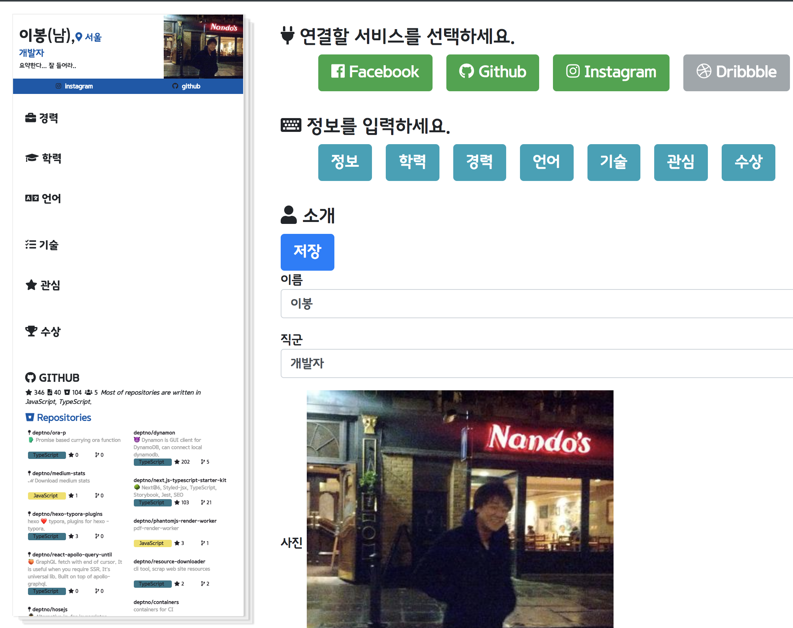

리페이퍼미의 초기 버전이다. 음 **프론트엔드 개발자인 것과 디자인 능력은 전혀 다른 것**😷이기 때문에. 핵심은 위에서도 잠시 언급했듯 서드파티 서비스들을 이용하여 보다 실질적인 그검고증 가능한 데이터를 전달하는 것이다. 또한 기본적으로 이력서와 채용의 상관 관계를 재정의해서 생각했다.

구직 활동을 위해서 이력서가 존재하는 것이 아니라 자신의 기록으로써(마치 일기처럼) 이력이 존재하고 이 이력이 채용 시 활용된다는 개념이다. 말 장난 같은 이 단어들의 순서가 바뀌면 서비스도 바뀌어야 한다. 구직이 전면에 나서는 것이 아니라 이력 관리가 메인이 되며, 이를 통해 관리되면 사람을 구하는 측(아마도 회사)에서 먼저 컨택을 할 수 있는 식이다.

모든 정보는 오픈되기 때문에 사회적인 면에서도 서로 더 열심히 이력을 쌓으려 서로 오픈 소스에 기여하려 한다는 다소 유토피아적인 상상도 하게된다. 개인적인 상상은 접어 두고서라도 모든 것이 투명하게 되면 우리는 회사나 소속, 학벌이 아닌 사람을 볼 수 있게 되고 이것은 모두에게 긍정적으로 작용한다는 점이다.

공개라는 것을 통해 경쟁을 촉발하고 정상적인 시장 경쟁을 가능하게 하며 가격(연봉)의 시장 가격 측정이 가능해 질 것으로 생각했다. 때문에 우리는 개인 사정으로 회사를 쉰다거나 다른 것을 하더라도 커리어 활동을 계속 해왔다는 것을 깃헙과 같은 공개된 정보를 통해 증명할 수 있고 이를 바탕으로 정당한 대우를 받을 수 있다.

될 것 같지도 않은 이미지를 하나 걸어 두고 말이 많았다. 😷 이미지를 보면 일단 여러가지를 연결하려고 해봤는데 그 중에 하나는 인스타그램이다. 이는 사진이나 패션 쪽에서는 이력서로 활용될 수 있겠다는 생각과, 일단 생각을 미루고 유명한 서드파티들을 연결해서 이력서 비주얼을 좀 뽑아보자는 의도였다. 페이스북과 링크드인에는 정보가 많아 활용하기에 더욱 좋다고 생각했는데, 마침 내가 시도하려는 타이밍에 지속적으로 페이스북 보안 이슈가 터지는 바람에 데이터를 얻을 수 없게 됬다. 더불어 링크드인은 채용과 관련된 서비스에서는 상용화할 수 없다고 못박고 있었다.

## 창업 지원

그리고 이 아이템으로 창업 지원을 받아 보면 좋겠다고 생각해서 조금 더 디자인을 다듬은 프로토타입을 만들어 지원을 했었다. 문서 작업(간만에 아래아 한글)에 생각보다 많은 시간이 소요되었다. 디테일한 BM을 요구하기도 했고 작성하다 보니 채용 시장의 미스매치 문제를 풀어내는 것이 까다로웠다. 서류를 통과하고 발표가 있었는데, 발표할 때만 해도 5명의 심사위원(?) 분들 중 한 분이 내 아이템에 지대한 관심을 표현하셔서 긍정적이었다. 5분 발표에 5분 질의인데, 무려 10분 간 거의 1:1로 대화했다. 결과를 기다리면서는 그로스 해킹이나 스타트업 경영 등에 대한 책을 읽었다. 사실 바로 돈이 되지 않는 영역에서 한다는 것 자체가 매우 리스키한테 퇴사한 지 워낙 얼마되지 않아 심적인 여유가 있었다.

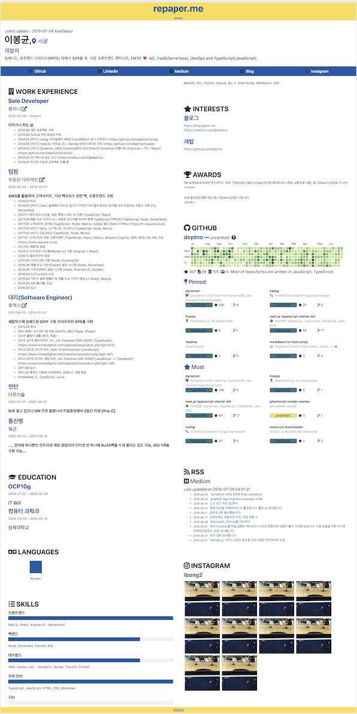

이것이 지원 당시의 이력서 프로토타입 산출물이다. 이력서 포맷은 중간에 다소 무의미해 보이는 스킬 그래프같은 것이 있는데, 해외에 있는 이력서 사이트의 포맷을 눈으로 카피하여 그대로 가져왔다. 자신의 정보 뿐만 아니라 **깃헙, RSS를 통한 블로그, 인스타그램** 을 이어서 내가 무슨 생각을 하는지 채용하는 측에서 파악할 수 있도록 투명한 정보를 제공했다. 그리고 이를 실시간으로 확인하면서 작성할 수 있는 에디터를 작성하고 문서 작성과 발표(울렁증이 있다)를 준비하고 구체화를 하는 데에 거의 한 달을 소모했다. 코딩은 1주일은 했던가...

긍정적인 결과를 생각했기 때문에 창업 관련 서적을 읽으면서 준비는 했지만, 한 편으로는 창업에 대한 별 다른 확신이 없는 상황에서 강제 트리거로 인생의 방향이 틀어지는 것에 대한 두려움이 있었다. 결론적으로 떨어져서 다행이었다. 상당히 많은 생각을 멀리까지 내다보며 고민을 했었는데 지원이나 투자는 사업화가 바로 가능한 시점(돈이 바로 나올 수 있는)에 하거나, 혹은 생각이 완전히 머리 속에 정리가 되어 바로 개발자를 고용해서 처리하거나, 그것도 아니면 자신이 모든 시스템의 초석을 구현할 수준에서 시작하는 것이 올바른 선택이겠다는 생각이 들었다.

난 돈을 벌고 싶은 것이 아니라 관리 포인트가 거의 없으면서 확장성을 갖춘 서비스를 구현하고 싶었고, 어느 날 통장에서 인프라에 대한 비용이 많이 빠져나간 것을 확인하고 유쾌하게 접속자가 벌써 100만이야? 이제 본격적으로 시작해볼까? 하는 생각을 하고 있기 때문이다(엔지니어의 상상).

### 글(블로그) 그리고 이력서의 관계

난 글을 쓰는 것을 꽤나 즐기는데 **특정 시점**에 **내가 느낀 것** 을 정리하는 것을 좋아하고, 개인적으로 필요하다는 느낌을 받는 시점이 남들보다 앞서있는 편이라 어떤 것에 대한 시도와 삽질을 할 떄, 그 시도 시점에 그것에 대한 정보가 별로 없기 때문이다. 누군가에게 조금이라도 도움이 될 수도 있다는 생각과 개인적으로 했던 것을 기억 못해서 다시 삽질하고 있을 때의 좌절감을 덜기 위해서이기도 하다. 그리고 또 그것이 **생각을 나타낼 수 있는 나의 정체성** 중 하나이기 때문이다.

정체성은 매우 중요한 자기 표현이므로, 많은 사람들에게 이 사람이 필요한가 아닌가에 대한 판단 기준이 될 수 있다. 그래서 이력서에는 꼭 자신이 작성한 글이 들어가야 한다고 생각하는데 "좌절을 극복한 경험이 있는가?"와 같은 회사에서 주는 포맷이 아니라 자기 자신이 선택한 주제여야 한다. 그래야 그 사람의 관심 분야까지도 판단할 수 있다.

위의 이력서를 보면, 이 생각을 모두 반영하여, 미디움과 관련한 RSS 파싱이 들어간 것을 볼 수 있다. 

---

결과 발표 후에 쉬면서 결국 나는 살아가는 동안 글을 쓸 테니까 이를 위한 무언가를 만들자고 생각했다. **목표는 만드는 것과 동시에 모든 것을 코드화해서 자산을 가져간다는 것이었다.**

개인이 서비스를 영위하기 위해서는, 위에서도 잠깐 이야기했듯이, 관리 포인트가 거의 없으면서 확장성을 갖춘 서비스를 구현해야 하며 추가적으로 비용에 대한 부담을 지지 않아야 한다. 결국 서버리스이며 사용한 만큼 과금되는 형식의 디비를 사용해야 했다. 그래야만 서비스 이용자가 없을 때 돈이 없어도 인내할 수 있으며 또 하나는 기술적으로 지금이 바로 그 시대라고 느끼는 나의 선택이었다.

기술의 선택과 무엇을 만들지를 정하고 프로토타입을 구현하면서 리프레쉬도 할 겸 여행을 두 번 다녀왔다. 출장이 아닌 해외 여행은 처음이었다. 회고록에도 적었던 것 같은데 이탈리아 여행은 오픈소스와 개발자의 삶에 대해서 옛 예술가들의 삶을 빚대어 많은 생각을 하게 한 여행이었다.

좋은 시간이었던 것과는 별개로 깃헙과 AWS OIDC, 코그니토로 엄청난 시간과 고통을 받고 있었고 다이나모디비에 맞는 구조에 대해 많은 고민을 하다가 너무 많은 시간을 써버렸다. 

목표는 만드는 것이 아닌 모든 것의 자산화이기 때문에 지난한 시간을 심리적 압박을 느끼며 보내야 했다.

그럼 나는 무엇을 만들고 싶었나.


## 리디시

어차피 가칭이므로 읽는 사람들이라는 콩글리쉬로 시작을 했다. 난 블로그를 운영할 때 데이터를 꾸려서 언제든지 이사할 수 있기를 원했다. 그래서 텀블러, 워드 프레스 등을 시도하다가 깃헙에 지킬을 선택했고 후에 최종적으로 노드 기반의 헥소로 옮겼다. 내가 글을 쓰면서 남도 글을 쓸 수 있으면 시너지가 있으므로 그렇게 해서 리디시의 구현을 시작했다. 코어 컨셉은 아래와 같다.

- 컨텐츠는 깃헙을 통해 관리된다.
- 리디시는 뷰만을 담당한다. 사람을 잡아두는 포인트는 댓글이 된다.
- 그리고 추후에 개발자 이외의 사람들이 들어올 수 있도록 일반인을 위해 일반적인 구조를 갖춘 블로그 시스템으로 간다.
- 글은 마크다운 기반이다.


### 기술적 어려움

#### AWS

한 번 결정되면 바꾸기 어려운 것들이 있는데 이러한 것들이 시작을 매우 어렵게 했다. 그 중에 하나가 인증인데 이를 AWS 코그니토와 엮어서 권한을 획득해야만 코그니토의 ~~GraphQL 서비스인~~ AppSync와 권한을 가지고 붙일 수가 있었다.

이 문제는 리페이퍼미에서도 뒤로 미루고 있던 문제였으나, 리페이퍼미 같은 경우 프론트엔드 작업이 거의 대부분이기 때문에 미루고도 작업을 진행했지만 리디시는 이를 해결하지 않고서는 진행을 할 수가 없었다.

결과적으로 OIDC를 통해서 깃헙과 코그니토를 붙일 수는 있는데 로그인 UI가 코그니토에서 제공되는 것으로 픽스되어 버리고(이게 무슨...) 만다. 덕분에 약 한 달?도 넘는 매우 길고 긴 시간을 소비했는데 이에 대해 "내가 한 번 해보겠다" 하시는 분들이 계실 수 있으니 도움이 되었던 링크와 AppSync 및 권한에 대해 남긴 글을 링크로 걸어둔다.

- [AWS AppSync, Amplify를 이용한 IAM 롤 기반의 풀스택 GraphQL 프로젝트 구현](https://googit.io/post/ap-northeast-2:c03f8bf0-992e-48a8-93b6-15787a0fc96f/public/aws-appsync-iam/)
- https://github.com/TimothyJones/github-cognito-openid-wrapper

결론적으로 말하자면 AppSync를 통해 GraphQL을 해결하려던 시도는 시간은 시간 대로 엄청나게 쏟아 붓고 결국 걷어냈다. 그 때 바로 정리를 했어야 했는데 시간이 지나 정확히는 기억이 나지 않지만 느낌적인 기억은 아래와 같다.

- AppSync는 GraphQL이 아닌 APIGateway의 포지션이라는 것에 포커싱을 해야한다.
- 문서에 명시되지 않은 불명확한 제약 사항이 존재한다.
- 람다보다 비싸다.
- 실제로 해보니 람다에서 GraphQL을 올리는 비용(boot time)이 생각만큼 비싸지 않았다.
- 타입스크립트 왕인데 `velocity` 문법을 통해 템플릿을 조작해야 하는 것도 매우 번거롭다. 심지어 객체는 자바였다.
- AppSync가 나온지가 언젠데 `terraform` 에서 아직도 지원하지 않고 있다. IsC 를 위한 차선책은 `serverless` 였으나 외부에서 생성된 리소스(디비)를 참조할 수 있는지가 불명확했고 심지어 내게는 동작도 하지 않았다.
- IaC가 불가능한 경우 웹에서 코딩하는 상황이 벌어지며 이는 버전 관리가 안 되기 때문에 실수하면 프로덕션은 끝이다.
- 유연성이 떨어진다.

 돌아다니다가 이런 글을 봤는데 매우 공감한다.

> New Solution === New Problem

최종적으로 느끼는건 DynamoDB(이건 그 자체로 어렵지만), S3, Cloudfront, Lambda 와 같은 AWS의 관록있는 서비스들을 사용해서 시작을 해야한다. 그렇지 않으면 삽질만 하다가 에너지가 고갈될 수 있다.

물론 AWS라 한들 새로운 솔루션이 다 안정적인 것은 아니다. 라이브러리와 마찬가지로 성숙도는 매우 중요한 것으로 신규 서비스를 이용해서 프로덕션에 올릴 생각은 역시 위험하다.

#### Github

깃헙의 인증 방식은 **Github App** 과 **OAuth** 두 가지가 존재하는데 Github App 이 새로나온 서비스였다. 확연히 더 나은 점이 있지만 기억해야 한다. 지금은 Github App을 통해서 다시 시도할 수 있는 여건이 됐지만 당시에는 Github App의 모든 시도 후에 한가지 요구 사항이 나와 맞지 않아 다시 철수했다. 이 것도 거진 한달 가까운 씨름이었다. 기억해야 한다.

> 새로운 솔루션은 새로운 문제를 야기한다.


### 다시 개발로

많은 시도와 많은 백 스텝을 하면서도 DynamoDB에 대한 공부는 계속 하고 있었고, DynamoDB의 철학이 현존하는 ORM에는 존재하지 않으며 올 초중순에 만들었던 다이나몬 또한 완전히 잘못된 이해를 바탕으로 진행했다는 것을 알게 되었다.

다시 한 번, 만드는 것이 중요한 것이 아니라 만들기 위한 자산을 챙겨야 하므로 다이나리(Dynalee)라는 DynamoDB를 위한 ORM을 설계하기 시작했다. 모토는 아래와 같다.

- DynamoDB는 **하나의 테이블**을 지향한다.
- **테이블 === 모델** 의 개념이 아니다.
- 모델은 타입스크립트의 지원을 통해 타입(인터페이스)로만 존재하면 된다.
- 데이터는 강타입이 유지되어야 한다.

이를 위해 다이나리의 초도 구현을 마치고 사용중이다. 여담으로 다이나리가 만들어지니 다시 다이나몬의 쿼리 기능을 위해 붙였으나 로컬에서는 사실 상 스캔 정도만 사용하기에 더 이상은 구현하지 않았다. 갈 길이 머니까.

다이나리에 대해서는 다시 한 번 DynamoDB에 대한 정리글을 올리면서 소개하겠지만 일단 링크는 걸어둔다.

2019년 목표 중 하나는 코딩 자체에 대한 집중이 있는데, 함수형 리팩토링을 통한 다이나리 1.0.0 과 함께 공개하는 순간이 오길 바란다.

https://github.com/deptno/dynalee

다이나리도 대충 완성됐겠다. 이제 드디어 구깃을 만들어 보기로 했다.


# 구깃

이제야 등장하는, 현재 글이 포스팅 된 https://googit.io, 구깃이다. 이 소개는 사용된 기술 스택 뿐 아니라 구깃의 UX 설계까지를 담고 있다.

**리페이퍼미**는 채용 시장의 미스매치 문제, 즉 사람들이 대기업으로 몰리는 문제와 작은 회사를 가기 싫어하는 것을 포함하여 그 회사의 존재 자체도 모르는 등 여러가지 문제를 해결하고자 했다. 때문에 이력서 퍼스트 전략으로 정리된 이력을 공개하는데 여기에는 유저의 여러 아이덴티티 중 **글쓰는 사람으로써의 유저** 가 포함된다.

**리디시** 는 깃헙 기반으로 컨텐츠를 관리하고 뷰만을 제공하는, 어떻게 보면 분산 데이터를 통한 커뮤니티이다. 로우 데이터는 언제나 유저에 의해서 소유되며 개인 블로그들의 집합체로써의 역할을 하고자 했다. 좋은 정보들이 각자도생하지 말고 함께 모여서 시너지를 이루면 좋겠다는 생각과 함께 나 또한 글을 쓰는 사람으로써 유저의 입장에서 UX를 전달하고자 했다.

이 두 가지 서비스에 대해 따로 갈 것인가 고민을 하다가 구조적으로는 따로 가는 것이 옳으나 합치면 시너지가 있을 수 있겠다 싶어 이 둘을 하나로 묶기로 했다.

두 서비스를 묶는 것이 합당한 이유는 내가 본 대부분의 개발자들이 깃헙에 자신의 블로그 링크를 걸어 두고 또 블로그에서 깃헙으로 크로스 링크를 걸어 두고 있으며 About 혹은 Resume 라는 메뉴 등을 통해 이력서를 동시에 공개하고 자신을 소개하고 있다.

이러한 과정이 개별적으로 반복되고 있는 비효율을 걷어 내려 한다.

사회적 문제에 대해서는 위에서 대략(?) 설명을 한 것 같으니 바로 구현으로 기술적인 이야기를 시작하고자 한다.


### 구깃의 기술 스택과 선택의 이유

기술적인 스택을 적어보면 백엔드는 Node와 GraphQL, 그리고 Lambda 를 통해 작성되었고 디비는 DynamoDB 가 사용되었다. 프론트엔드에서는 Next.js 를 사용했으며 `export` 기능을 통해 빌드된 HTML을 S3 + Cloudfront 조합으로 서비스했다. CSS 프레임웍으로는 `tachyons` 선택했고 SEO와 관련해서는 Lambda@edge 를 통해 처리했다. 이외의 인프라 관리를 위해서는 `serverless` 와 `terraform`  둘이 사용 되었다.

#### TypeScript

원래 쓰던 것. Full-Stack 타입스크립팅이란...

#### GraphQL

GraphQL 은 몇 가지 면에서 매우 큰 장점이 있다. 하나는 코드와 싱크되는 **문서화**고 하나는 한 번의 요청에 여러 쿼리를 실행할 수 있는 구조이다. 또한 개발 환경에 있어서도 GraphiQL 이라는 인터페이스를 제공해서 매우 쉽게 데이터를 확인할 수 있다.

또 따로 오버뷰에 대한 글을 쓰기로 하고 여기에선 타입스크립트와의 매칭과 관련해 `codegen` 그리고 가장 유명한 라이브러리인 `react-apollo` 에 대해 코멘트만 남기고 가려고 한다.

##### codegen

코드젠과 관련된 프로젝트들이 여럿 있다. 그 중에 난 `graphqlgen` 이라는 것을 선택했다. 일단 코드젠은 GraphQL의 스키마로 데이터를 선 정의하고 나면 이를 통해 타입스크립트로 데이터 타입 및 리졸버의 타입을 정의해준다.

타입스크립트와 GraphQL을 함께 쓰면 애매한 것이 중복된 타입의 정의인데 이를 해결해준다고 보면 된다. 한 가지 염두해 두어야 할 점은 최근 `babel` 7 버전이 나오면서 타입스크립트의 `namespace` 를 지원하지 않는다는 점이다. `codegen` 은 타입을 `namespace` 기반으로 뽑아주기 때문에 바벨 기반의 프론트엔드에서까지 타입을 이용하려고 하면 문제가된다. 이에 대한 이슈 해결은 또 추후💬 에 글을 남겨 보도록 한다.

##### react-apollo

가장 많이 쓰는 라이브러리지만 기능이 너무 많다. 이 말을 꼭 하고 싶다. 뮤테이션 후에 캐시를 업데이트 해야하는 둥, 어떤 케이스는 캐시 키가 중복되면 UI 업데이트가 되지 않는 둥 꽤나 복잡한 문제가 있다. 웬만하면 조금 더 라이트하고 완전히 제어 가능한 라이브러리를 사용하기를 바란다.

난 AWS 에서 제공하는 `@amplify` 패키지를 사용했다.

#### Serverless

완전한 서버리스 지향이므로 서버리스의 배포 환경을 실현해 줄 프레임웍이 필요한데 다소 완벽하진 않으나 커뮤니티가 가장 커서 커뮤니티의 도움을 많이 받을 수 있다는 장점이 있어 `serverless` 를 선택할 수 밖에 없었다. 이에 관련된 생각은 일전에 한 번 정리해뒀었는데 잘 작성해 뒀는지 또 아직 유효한지 모르겠으나 링크는 걸어둔다.

[서버리스 프레임웍의 관리 이슈](https://googit.io/post/ap-northeast-2:c03f8bf0-992e-48a8-93b6-15787a0fc96f/public/serverless-management-issue/)

#### Tachyons

**Functional CSS** 를 모토로 하는 CSS 프레임웍이다. 이에 관해선 반드시 공유를 하고 싶어 다음 글감으로 생각해두고 있다. CSS와 컴포넌트의 모듈화 관점에만 포커싱되고 있는데 생산성 측면에서 본다면 일정 수준의 암기를 통해 매우 큰 생산성과 고급 디자이너(?) 들이 정의해 둔 일종의 패턴을 이용할 수 있게 해준다. 덕분에 디테일한 디자인 혼자 한다고 고생 안하고 기본 설정으로 여기까지 오게 해줬다.

**구깃은 현재 Tachyons 의 힘으로 100라인 미만의 프린팅과, 예외 처리를 위한 CSS 만을 가지고 있다.**

이와 관련해서 최근 작성한 글이다.

[Functional CSS, Tachyons](https://googit.io/post/ap-northeast-2:c03f8bf0-992e-48a8-93b6-15787a0fc96f/public/tachyons/)

#### Terraform

모든 인프라는 다음 프로젝트에서 그대로 쓰일 가능성이 높다, 게다가 가장 안정성이 높은 서비스들로 구성했기 때문에 더욱 그렇다. `serverless` 와 겹치는 면이 있어서 이 부분에 대한 정리가 아쉽기는 하지만 나름 최선을 다해 정리를 한 것 같다.

`workspace` 를 통해서 `development` 환경과 `production` 을 모두 꾸릴 수 있는데 다소 완벽하지 않아 수동 머지가 필요하며 어떤 경우에는 완벽히 동작하지 않을 수도 있다. 삽질할 시간이 많지 않다면 `workspace` 를 사용하지 않는 것도 나쁜 선택은 아니다.

#### 외에 추가적인 코멘트

이 외에도 최근에 발표된 Lambda Layer 를 통해 PDF를 생성할 수 있는 레이어 등의 기술이 들어갔다. 이 부분은 추후(?)💬 Puppeteer + Font 이슈를 처리할 때 정리를 해보겠다.


### 구깃의 구조

```bash
.
├── api
├── docs
├── infrastructure
├── node_modules
├── packages
└── www
```

구깃은 서버와 클라이언트 간의 라이브러리 및 타입 공유를 위해서 부분적으로 모노레포 구조를 활용하고 있다.

#### api

serverless` 를 통해 배포되는 함수들의 집합이며 서버에서 쓰이는 유틸류 등이 함께 정의되어 있다.

#### docs

마크다운 모음

#### infrastructure

`terraform` 파일들인 `*.tf` 파일과 Lambda@edge 관련 이슈가 있어 엣지 함수들은 이 곳에서 관리되고 있다.

#### packages

서버와 클라이언트가 함께 사용이 가능한 타입 및 라이브러리, 혹은 완전 독립적인 라이브러리를 밖으로 빼기 위해 사용되었으며 반드시 필요한 이유는 아래와 같다.

- `codegen` 을 통해 생성되는 GraphQL의 타입들 또한 모노레포의 패키지로써 공유된다.
- `next.js` 가 babel 7 사용하면서 생기는 `namespace` 이슈를 외부 라이브러리화 해서 우회한다.

#### www

`next.js` 에 의해 Static HTML 이 빌드되는 역할을 한다. 여기서 생성된 아웃풋은 `terraform` 에서 생성한 S3 버킷으로 올라가 Cloudfront 를 통해 서비스 된다.


### 구깃의 UX에 대해

설명은 글이 너무 길어지고 아직 기능이 많지 않아 이력서 작성에 한정하겠다.

> 편하고 빠르게 작성할 수 있어야한다.

이를 이루기 위해서는 유저의 선택을 하나씩 줄여가는 노력이 필요하다. 일단 몇 가지 상황을 가정해 보았다.

#### 유저는 어떻게 이력서를 작성하는가?

아마도 급한 순간이 아니라면 이력서는 데스크탑이나 키보드가 있는 태블릿에서 작성하는 일이 대부분일 것이고, 급하게 이력서를 내야하는데 회사에 종속된 문구가 들어간 경우라면 이는 모바일에서도 수정이 필요할 것이다.

#### 이력서는 어떻게 쓰일 수 있나?

구직 활동을 위해 제출용으로 쓰일 수 있을 것이고 이 경우 아마도 받는 쪽에서는 PDF 제출을 원할 것 같다. 또 그냥 링크용으로 걸어 둘 경우가 있을 것 같다.

#### 그럼 이제 UX 설계를 이야기해본다.

>  이력서는 작성하기 쉬워야 하며 모바일에서도 수정 가능해야 하고 PDF로 산출 가능해야 한다.

이를 위해서 회사 백오피스 관련 업무 툴을 만들 때에도 언제나 주장했던 것이 예쁨 때문에 탭을 버려선 안 된다는 것이다. 탭과 엔터 만으로 빠르게 작성이 가능해야 한다. 구깃의 레주메는 그렇게 구현이 되었다. 그렇기 위해서는 탭의 동선을 설계해야 한다.

UX는 당연해야 하는 것이 맞는데 당연하지 않은 UX 때문에 고생하는 것이 대다수이다. 그럼 무엇이 당연한가. 이미지로 이력서 작성의 한 부분을 설명해 본다.

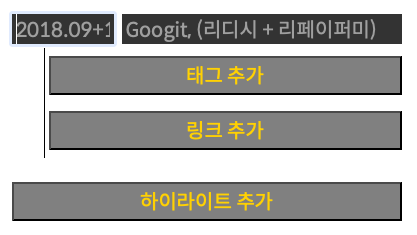

업무 경험 중에 하이라이트를 입력하는 창이다. 다른 하이라이트를 추가하기 위해 `하이라이트 추가` 버튼을 누르면 어떻게 되어야 하나?

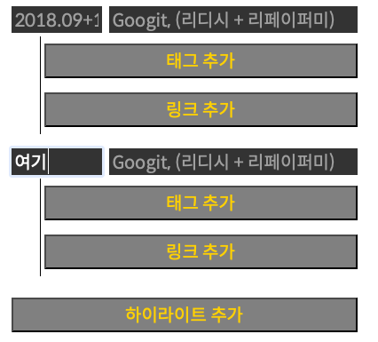

위에 글로 여기라고 표시된 곳으로 커서가 움직여야 한다. 유저는 지금 하이라이트를 치기 위해 `하이라이트 추가` 버튼을 눌렀으므로 그 시작으로 동선을 이동해야 한다. 추가하지 않고 다음으로 넘어갈 때는 `하이라이트 추가` 버튼에서 다시 한번 탭을 눌러 다음으로 이동하면 된다.

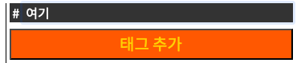

`태그 추가` 버튼을 눌르면 **# 여기** 로 커서가 이동한다.

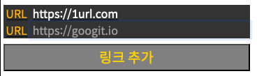

`링크 추가` 를 눌렀는데 생각해보니 쓸 링크가 없어서 비워놨다.

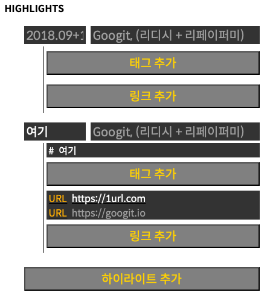

하이라이트를 추가해두긴 했는데 첫 번째 것은 비었고 (실제로는 마지막이 비워질 확률이 높지만) 인위적으로 캡쳐를 하다보니 이렇게 됐다.

두 번째 하이라이트의 링크들을 보면 두 번째 `URL` 이 비어있는 것을 확인 수 있다. 여기에서 사람들은 헷갈릴 수 있다.

> 잘못 추가했는데 어떻게 지우지?

이런 부분에 대해서 안내 문구는 있어야겠지만 아직 작성하지 못했다. 내가 이끄는 UX는 이러하다. 비어있는 공간은 저장 시에 일괄 정리해준다. 조금 더 인터렉티브하게 유저가 느낄 수 있도록 하려면 하이라이트를 벗어나는 순간 삭제되는 것이 더 옳으나 현 상태의 구현은 여기까지다.

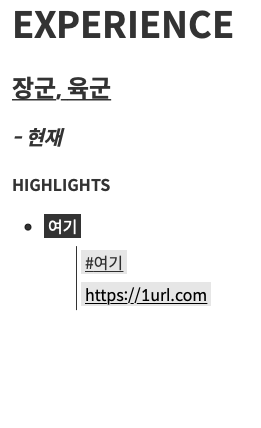

저장을 눌렀을 때의 결과이다. 불필요한 내요은 삭제되고 입력된 내용만이 남았다. 유저는 탭과 엔터(버튼 선택)로 모든 이력서를 작성한다. 이는 모바일에서도 유용한데 모바일 역시 탭과 엔터가 제공되기 때문에 굳이 화면을 터치했다가 마우스를 들 필요없이 한 번에 위에서 아래로 작성을 해나갈 수 있다.

#### 전반적인 작성 UX는?

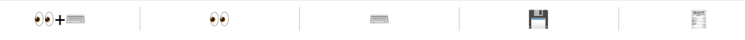

사실 이미지(이모지) 보다는 명확한 글자를 선호하나 개발 과정에서 이모지를 선택한 상태이다. 디자이너가 없다 보니 기본으로 사용 가능한 이모지를 빌려 왔다.

왼쪽부터

- 미리보기 + 작성(모바일에선 공간이 부족하여 이 메뉴는 보이지 않는다)

  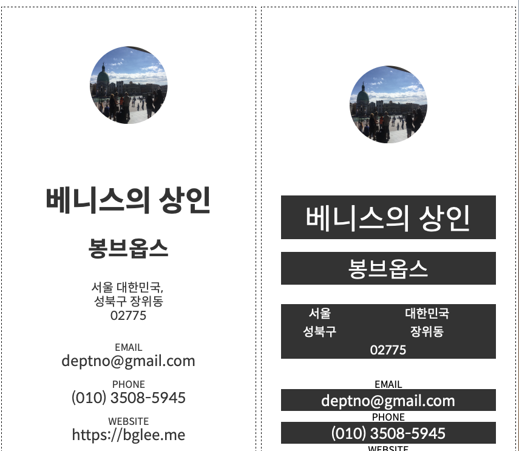

- 미리보기 - 위 화면에서 왼쪽만 빠르게 보는 메뉴

- 작성 - 미리보기는 스킵하고 작성에 올인하는 메뉴(모바일에서는 이게 디폴트다)

- 저장 - 저장 메뉴이며 저장 완료시에는 이력서 페이지로 이동한다.

- 외부에 공개되는 실제 이력서 페이지다.

  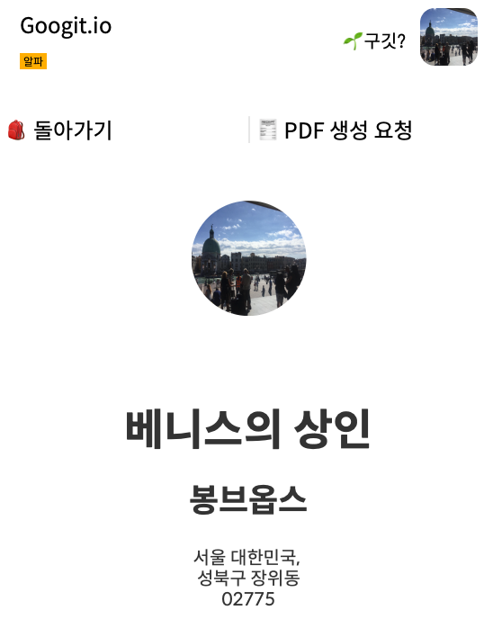


프로필 영역만을 가져왔으며 PDF 생성 요청이 보이는 것을 확인할 수 있다. 이를 통해서 PDF 생성이 가능하고 프린팅을 위해 CSS 클래스를 사용하여 불필요한 정보를 삭제하고 리페이퍼미에서와 같이 서드파티를 추가한 이력서 생성이 가능하다.

> 아직은 깃헙 밖에 지원하지 않는다.

#### 서드파티는?

리페이퍼미의 정신은 죽지 않았다. 😲 현재는 깃헙만을 연결해두고 있다. 그 결과는 아래와 같이 나오게 된다.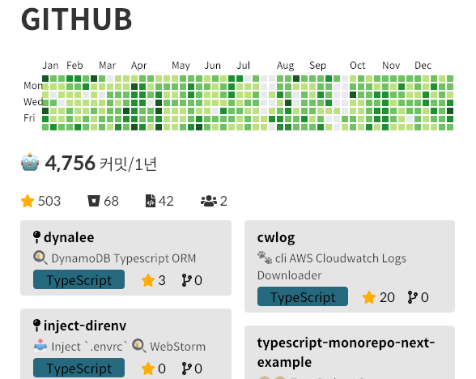

PDF 섹션이 어이지므로 PDF에서는 아래와 같은 형식으로 출력된다. 유저가 `pin` 을 한 저장소들과 스타가 많은 레포를 가지고 PDF 출력 한페이지를 목표로 설계되었다.

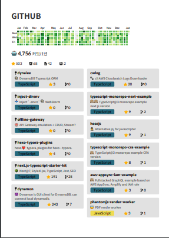

#### PDF

이력 관리 외의 관점에서 제출용으로 쓰기 위해서는 PDF 출력이 되야한다. 이 부분은 `puppeteer` + Lambda 를 통해 쉽게 프로토 타입을 구현했으나 현재는 폰트 이슈를 해결해야 하는 상황이다. 결과물은 최대한 페이지에서 보기 편하게 CSS 를 추가적으로 구성했고 기존 웹의 이력서 코드가 그대로 사용되었다.

그럼 PDF에서 차별화되는 기능(UX) 소개를 마지막으로 해본다.

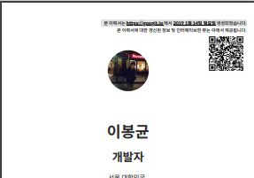

##### QR Code

이력서는 대부분 면접시에 하드 카피로 제공이 되는데 이에 QR Code를 심어 유저에 대한 **최신** 정보를 좀 더 **인터리렉티브한 뷰**에서 제공할 수 있도록 했다.


## 정리

구깃에 대한 코딩 시간 보다도 시스템의 이해와 공부, 서비스 연동 간의 삽질에서 시간을 많이 소요 했지만 결국 오픈을 했다. 이제 이 서비스의 목표인 채용(구직)을 수행하면 된다. 💬...

> 내가 만든 서비스를 통해 내 이력서를 만들고 이를 통해 취업하고 서비스에 피드백한다.

첫 번째 유저로서의 할 일을 완수하고 나면, 여유를 가지고 조금씩 완성도와 기능을 확장해 나가고자 한다. 긴 글을 읽어주신 분이 있다면 도움이 되길 바라고 일기와도 같은 글을 읽어 주셔서 감사하다.
