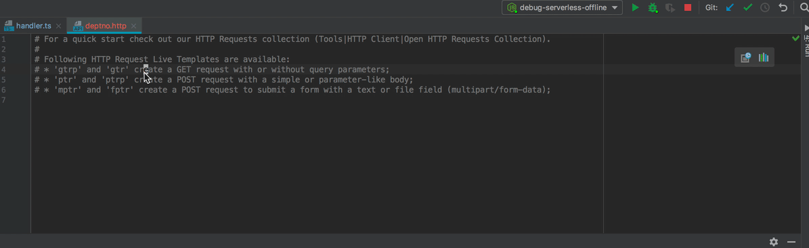

작년 이맘 때 쯔음 회사에서 도입을 할때에 퇴사해서 본격적으로 사용해 볼 기회가 없었다가 풀스택 개발을 위해 매번 API 뚫는게 귀찮아서 **GraphQL** 을 도입했다. 정리하기에는 좀 늦은 감이 있는데 더 잊기 전에 간략하게 정리한다.

타입스크립트와의 만남, 많이들 사용하시는 `apollo` 의 사용 경험을 오버뷰 형식으로 훑으면서 느낀점을 적어본다.


## 왜 GraphQL을 선택했는가?

API 문서를 빌드하는 방식이 너무 구식이라 좀 놀랬던 기억이 있다. 주석기반의 시스템도 있지만 결국 주석과 코드의 싱크 이슈는 존재하는 것이며 별도로 마크다운을 작성하거나, 많이 쓰이는 스웨거 역시도 코드와 문서의 작성은 별개라는 점이 놀라웠다.

쿼리 트래픽 양의 최적화는 프론트엔드 입장에서는 사실 상관 없고 오히려 코드량만 늘어나게 된다. 또 여러 쿼리를 한번에 날리는 것 또한 비동기처리가 일상인 프론트엔드에서는 어려운 일이 아니다.

그럼에도 불구하고 GraphQL 은 프론트엔드서 오히려 요구를 해서 쟁취해야한다. 그 이유를 설명해 보겠다.

### 신뢰가능한 문서

API와 문서와의 동기화 이슈가 있다. 이게 회사의 시스템이 약하면 동기화 이슈가 발생하고 그럼 결국 프론트엔드 쪽에서 시간을 잡아먹히게 된다. 

내가 본, 그리고 아는 백엔드에서 문서를 작성하는 방식은 3 가지다.

- 직접 작성(마크다운, 엑셀, 워드, 템플릿(언어) 기반)
- 주석 기반 문서 빌드(JSDoc 계열)
- 코드를 통한 직접 빌드

API는 환경에 따라 끔찍하지만 `text` 문서로 전달될 수도 있다. 그보다는 워드가, 그보다는 엑셀이나 마크다운이 낫다는 차이가 있지만 기본적으로 **직접 작성**한다는 측면에서 같다. Swagger 는 꽤나 유명하지만 결국 기반 언어를 가지고 코드와 별개로 씌여지는 것이며 이는 필연적으로 문서 오류를 동반한다.

**주석을 통해서 문서를 작성**할 때도 마찬가지다. 주석 자체는 코드를 통해서 IDE로 부터 주석을 자동으로 생성할 수 있지만 API 가 수정될때는 적절히 반영되지 않는다. 이는 역시 마찬가지로 문서의 동기화 오류를 가져온다.

**코드를 통해 직접 빌드**되는 방식은 코드화의 동기화가 이루어지기 때문에 문서를 신뢰할 수 있는다. 사내 개발자 누군가가 추가적으로 만들어 코드를 기반으로 스웨거 문서나 마크다운등을 빌드할 수도 있겠다. GraphQL은 여기서 더 발전된 모습을 보이는데 빌드해서 스키마 파일을 만들수도 있지만 그 자체로 문서를 서빙할 수도 있게 되어 있다.

때문에 GraphQL은 현 서버의 상태를 그대로 반영하는 문서를 얻을 수 있다.

### API 테스트 환경

스웨거는 문서에서 API 테스트를 지원 하기 때문에 이를 사용할 수도 있겠지만 경우도 있지만 대 다수의 경우는 커맨드라인에서의 테스트를 하거나 포스트맨, 인섬니아 등을 통해서 API를 테스트할 것이라 생각된다. 복잡한 파라메터나 재사용성을 위해서는 아마도 후자가 자주 쓰이리라 본다.

개인적으로 이보다는 더 편한 형태가 [웹스톰 서버리스 디버깅 설정](https://googit.io/post/ap-northeast-2:c03f8bf0-992e-48a8-93b6-15787a0fc96f/public/webstorm-debug-serverless/) 글에서 설명한 텍스트 파일 형태다. 



GraphQL 은 더 나은 환경을 제공해주는데 자체적인 프로토콜(문서, 디버깅을 위한 프로토콜이랄까..)을 지원하고 그에 대한 툴(GraphiQL, Playground)이 지원되어 IDE를 사용하듯이 자동완성이 지원되는 환경 속에서 신뢰할 수 있는 문서 기반으로 데이터를 테스트할 수 있다.

### 강한 타입 기반

GraphQL은 타입 기반으로 작성되므로 문서에서 확인 되는 타입 이외의 값은 값에 대해 두려움을 가질 필요가 없다. 이 부분은 서버 에러로 처리되며 프론트엔드에는 문서에서 확인된 타입만이 전달된다.

### 

## 타입스크립트와 GraphQL 의 조합

둘다 타입기반이므로 타입을 두번 정의해야하는 아이러니가 발생한다. 프론트엔드와 백엔드가 갈라져있는 경우에는 스키마 파일과 타입스크립트의 데피니션 파일이 따로 존재하기에 당연하다 생각 될 수도 있지만 결국 두번 정의하게되면 관리상에서 동기화 오류가 발생각하게 되므로 이를 제어하는 몇가지 방법이 있다.

결정해야하는 선택이 있는데 이에 따라서 사용되는 라이브러리가 갈라지게 된다.

- GraphQL 먼저 스키마 정의
- 타입스크립트 먼저 스키마 정의

아마도 GraphQL 자체가 서버에서 쓰이기 때문에 SDL 이라는 스키마가 먼저 정의되고 그에 따라 코드를 생성하는 방식이 일반적일 것이라 생각된다.

풀스택의 경우에는 타입스크립트를 통해서 SDL을 생성하는 방식을 취할 수 있으나 회사에서는 운전대가 백엔드팀에 있을 것이므로 타입스크랩트에 대한 익숙함을 뒤로 난 전자를 선택했다.

타입스크립트를 통해 스키마를 생성하는 방식은 아래 저장소를 확인해보기 바란다.

https://github.com/19majkel94/type-graphql

### codegen

`codegen` 이라는 라이브러리를 통하면 SDL 로 정의된 스키마 파일을 통해 타입스크립트 인터페이스 파일을 생성할 수 있게 된다. 생성 타입은 두개로 데이터에 대한 인터페이스(타입)와 또 하나는 서버쪽에서 쓰이는 리졸버에 대한 타입 정의다. 때문에 타입스크립트를 풀스택 언어로 선택하게 되면 여기서 이점이 있다.

### 타입스크립트 정의 !== SDL

예를 들어보자면 SDL에서 정의되는 정보는 API의 리턴 정보를 가지고 세팅된다. 그런데 서버쪽에서는 실제로 서버내에서 사용되지만 밖으로는 노출되어서는 안되는 프로퍼티등이 정의되어 있을 수 있으며 이런 경우 서버와 타입스크립트의 정의는 서버와 클라이언트를 모두 아우르거나 따로 정의되어야한다는 점을 생각하고 있어야한다.

예를 들면 아래와 같이 SDL을 정의해서 API응답으로는 `name` 만이 노출되도록 한다.

```graphql
type WithSecret {
    name: String
}
```

이를 사용하는 서버 쪽 코드는 아래와 같이 되어 있다.

```typescript
type WithSecret = {
	name: string
    serverOnly?: string
}
```

이를 통해서 서버에서는 `serverOnly` 프로퍼티를 저장해서 사용하지만 외부로는 노출되지 않는다. 이런 경우 클라이언트와 서버의 타입이 달라지게 되는데 옵셔널 프로퍼티를 이용하거나 둘을 분리해 내야한다는 의미다.


## 💔 조합의 문제

현재 프론트엔드에서 바벨과의 궁합이 문제가 되고있다. babel 7에서는 타입스크립트의 `namespace` 키워드를 지원하지 않고 있는데 `codegen` 은 `namespace` 기반의 코드를 생성한다. 이 때문에 빌드환경에서 바벨이 들어간다고 하면 충돌이 나게 될 것이다.

### 외부 라이브리화를 통화 우회

모노레포 구성이나 레포를 분리하여 이에 대한 타입을 하나의 패키지로 분리해버리는 방법을 사용했다. 난 전자를 통했다.


## react-apollo

2.0에 오면서 선언적 방식의 React와 같은 컨벤션으로 바뀐 듯 보인다. 때문에 `<Query/>` 와 같이 컴포넌트로 제공이되며 오프라인(로컬 스테이트 제어) 지원, 캐시등에 대한 정책의 지원등 엄청나게 많은 플러그인이 존재하는 것으로 보인다.

주변이나 어떤 글을 보면 리덕스를 완전히 걷어낸다고 하시는 분들도 계신데 프론트엔드 내에도 스테이트가 존재하는 한 리덕스를 완전히 걷어내기 어렵다고 보고 있다.

개인적으로는 아폴로를 쓰다가 걷어 냈으며 심플한 `@amplify` 의 라이브러리를 사용했다. 아폴로를 걷어낸 이유를 적어본다.

### 너무도 번잡하다.

캐시부터 시작해서 네트워크 레이어등등 각종 패키지가 따로 존재하여 혼란스럽다. AWS와의 조합을 위해서(그와중에 AppSync는 또 따로) 추가적인 옵션이 있고 이런 것들이 너무나도 많아 대체 어떤걸 참조하는 것이 최적인지에 대한 혼란이 있었다.

신뢰할 수 있는 문서를 기반으로 코드 어시스트 지원 받으면서 API 날리겠다는 너무 복잡하다는 생각이다. 게다가 캐시쪽에서는 오브젝트에 대한 키를 바꿀 수 있는있는데 설명하기 어렵지만 데이터 상태에따라 캐싱 오류가 발생하며 이를 예외처리하기 위한 추가적인 코드가 들어간다는 의미 정도로 생각해주면 될 것 같다.

### 선언적 방식

이건 페이스의 릴레이가 아폴로에게 밀리게된 이유 아니었나 싶은데 2.0가서는 릴레이 방식으로 바뀐다는 생각이다. 데이터와 관련해서 컴포넌트와 묶어버리는 방식은 유연성을 크게 저해할 수 있다는 우려가 있다.


## 정리

실제로 작업하면서 매우 편하게 사용할 수 있었다. 리졸버에는 파라메터와, 인증정보가 그대로 전달되므로 다른 영역을 생각하지않고 데이터 리턴만 하면된다. 그럼에도 불구하고 모노레포를 이용한다거나 레포를 분리하는 등의 작업은 모노레포의 세팅 경험이 없는 분들에겐 고통이 클 수 있다.

AWS Lambda 와의 시너지, 추가적으로 AWS 의 GraphQL 서비스인 AppAync 까지 쓰려고했는데 주제가 분리된다는 느낌을 받아 짧게 마친다.