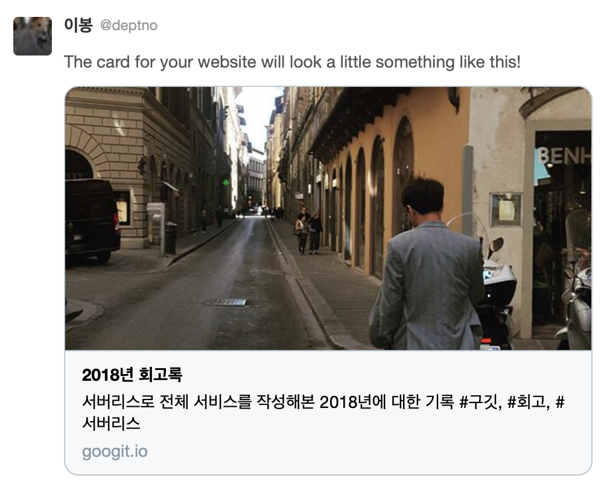
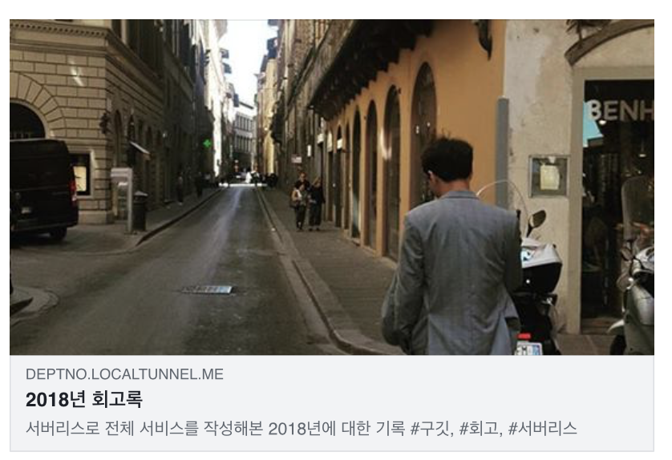
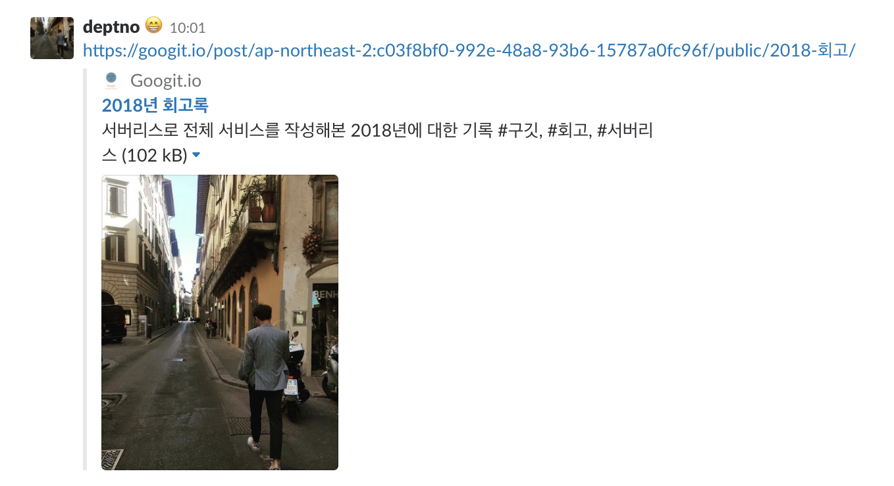

**SEO** 를 처리하기 위한 여러가지 작업이 있는데 그 중에 이번은 글은 **소셜 메타 태그** 를 중심를 중점적으로 글을 쓰겠다.

## 소셜 메타 태그란 무엇인가?

소셜 메타 태그를 **SEO** 라 부르기는 애매하지만 검색어가 그 뿐이라 여기선 그렇게 부르기로한다. 

> **SEO** 는 search engine optimization 으로 말그대로 검색엔진 최적화다. 글에서는 최적화라는 단어와 혼용을 하도록 하겠다.

그럼 소셜 메타 태그는 무엇이고 어디에 쓰이는가? 아래 그림들을 보자







올리고 보니 사진이 좀 웃기긴한데 가장 최근의 글을 가지고 샘플을 올렸다. 위에서부터 순서대로 트위터, 페이스북, 슬랙 순이다. 카카오톡에서도 지원을 하고 사용자 입장에서는 미리보기라 할 수 있다. 사람들에 의해 공유가 될때 그 클릭률을 높이기 위해선 필수적으로 이 작업이 필요하다. 이에 대한 정보를 헤더쪽에서 태그로 지원하는 것들이 있는데 이를 **소셜 메타 태그**라 한다.

### oembed, ogtag 와 twitter tag

> 각 태그에 대해서 설명하진 않는다. 사용 법은 공식 문서를 참조하면 될 것 같고 실무에서 알아두면 유용한 점 등을 써 내려가겠다.

[HTML](https://googit.io/post/ap-northeast-2:c03f8bf0-992e-48a8-93b6-15787a0fc96f/public/seo-social-meta-tags/) 에 자체에도 이런 페이지에 대한 정보를 담는 태그가 있다. 잘 알고있는 `<title/>` `<meta name="description"/>` 태그와 같은 것들이다. 이런 부분은 검색엔진쪽에서도 유용하게 사용이 된다. 트위터와, 페이스북등 수많은 공유가 이루어지는 쪽에서는 이런 정보를 더 필요로해서 추가적인 태그를 정의하고있다.

바로 `ogtag` 와 `twitter` 태그가 그 것이다. 트위터 태그가 트위터 전용인 것에 반해 `ogtag` 늦 페이스북이 밀었지만 좀 더 범용적으로 사용되는 스펙 느낌이다. 슬랙과 카카오톡에서도 이 태그를 사용하는 것으로 기억한다. 🤖

트위터 쪽에서도 `ogtag` 를 인정(?)하여 두 태그가 중복되는 부분이 있는데 이러한 경우 `ogtag` 가 정의되어 있다면 트위터 태그를 추가로 정의 할 필요는 없다. 코드를 예로 들면

```html
<meta property="og:type" content="website"/>
<meta property="og:url" content="https://googit.io"/>
<meta property="og:site_name" content="Googit.io"/>
<meta property="og:title" content="Googit"/>
<meta property="og:description" content="developers identity"/>
<meta property="og:image" content="https://googit.io/static/images/icon/512-googit.png"/>
<meta property="og:image:alt" content="Googit logo"/>
<meta name="twitter:card" content="summary_large_image"/>
<meta name="twitter:site" content="@googitcast"/>
<meta name="twitter:@creator" content="@googitcast"/>
```

`ogtag` 는 `meta` 태그의  `property`, `twitter` 태그는 `name` 프로퍼티를 통해서 정의하는 것을 볼 수 있고 `og:image` 가 정의 됐으므로 트위터에서는 `twitter:image` 를 가진 메타 태그가 없을 시 `ogtag` 쪽에서 상응하는 태그를 레퍼런스하여 처리하게 된다. 자세한 내용은 문서를 참조하자.

## 소셜 메타 태그 적용하기

**SEO** 가 필요한 곳이 있고 필요하지 않은 곳이 있다. 만약 **SPA** 로 서비스를 제작중이라면 **SEO** 가 하나의 허들로 작용할 수 있다.

**SPA** 로 서비스를 만들고 있다라면 정책 결정에 가장 중요한 팩터 중 하나는 **웹 서버가 올라가는지, 혹은 아닌지**다. 서버가 올라가게 되면 못하는게 없으므로 아무 걱정이 없다. 그런데 서버가 올라가지 않는다면 생각할 것이 꽤나 많아진다.

**서버 사이드 렌더링**과 **클라이언트 사이드 렌더링** 방식이 있다. 렌더링이라는 표현이 씌이지만 사실은 렌더링의 요소인 **DOM** 의 시드가 될 **HTML** 이 어디서 만들어지는다. 애매한 표현이지만 이 정도면 될 것 같다.

엔드 유저측(브라우저) 에서 완성되는지 아니면 서버에서 만들어져서 스트링으로 내려오지에 따라 이 차이가 갈린다.  이 글은 소셜 메타 태그가 주 주제이므로 이 둘에 대한 설명은 스킵한다.

성능적인 측면은 차치하고 **SSR** 의 지원 여부에 따라 두가지 중요한 이슈가 발생한다.

하나는 **SEO** 이고 하나는 이 글에서 설명한 **소셜 메타 태그** 다. **SEO** 라 하면 주로 구글을 타겟으로 한다. 그럼 소셜 메타 태그는 무엇을 타겟으로 개발하는가?

이 것은 요구사항에 따라 다르다. 😶

렌더링 방법에 따른 적용 방법을 알아보자.

### 서버 사이드 렌더링

> 서버가 존재한다

이 말은 동적인 처리가 가능하다는 뜻이다. 유저에게 데이터가 이에 대한 처리가 가능하므로 유저에게 내려줄 HTML을 채워넣으면서 `ogtag` 와 `twitter` 태그들도 채워 넣으면된다. 이슈가 없다.

### 클라이언트 사이드 렌더링(CSR)

> ⛔️ 정상적으로 소셜 메타 태그를 적용할 방법이 없다.

크롤링 방식은 전적으로 공유나 검색이 이루어지는 서비스 제공 업체쪽에서 이루어진다.(구글, 페이스북, 트위터등) 때문에 이들이 CSR 을 지원하는지가 중요하다. 페이스북과 슬랙, 트위터는 모두 이를 지원하지 않는다.

정적인 파일들로 구성된 이 방식은 모두 로딩후에 클라이언트 측에서 서버에 데이터를 요청하고 그 이후 유저에게 보여줄 최종화면을 완성한다. 때문에 초반에 데이터가 존재 하지 않는 이슈가 있다. 때문에 그냥 사이트 자체의 정보를 가지고 우려먹던가 아니면 결국 서버를 통해야한다.(서버리스는 서버다 💬)

### 그러나 방법은 있다.

현실적으로 CSR로 서비스를 제공한다는건 퍼블릭 클라우드에서 제공하는 파일 서빙 서비스를 제공한다는 것을 의미한다. 왜냐면 파일 서빙 자체도 서버가 하는 일이기 때문에 실제 온프레미스류나 IDC, 혹은 클라우드에서 서버를 띄워야하기 때문이다. CSR로 서비스를 제공한다는 것은 **파일만 서빙할 수 있는 서비스 사용한다.** 와 같다는 의미다.

AWS 와 같은 경우는 보통 이런 서빙을 위해서 S3(파일 서빙) + Cloudfront(속도 및 SSL처리) 조합을 하게 되는데 lambda@edge 라는 클라우드 프론트 전용 훅 함수를 추가할 수 있다. 이 제한된 훅을 이용하면 `nginx` 와 비슷한 역할을 할 수 있게 되며 이를 통해서 동적인 처리를 할 수 있게 된다.

이에 대해선 별도의 요청이 있거나 급히 써야할 글 소재를 모두 사용한 경우에 작성토록 하겠다.

## 소셜 메타 태그를 적용하기 위한 툴과 문서, 노하우

- OGTag

  - https://developers.facebook.com/docs/reference/opengraph#object-type

- Facebook

  - https://developers.facebook.com/tools/debug/
  - https://developers.facebook.com/docs/sharing/webmasters/crawler/
  - https://developers.facebook.com/docs/sharing/webmasters?locale=ko_KR
  - AWS. virginia, ohio, oregon 3 리전에서 랜덤하게 크롤러가 접근함
  - 크롤러가 **ngrok** 을 뚫고 들어오지 못함 **localtunnel** 을 이용시 가능
  - `og:url` 같은 경우는 실제 서비스 되는 `url` 과 매치되어야하기 때문에 어차피 로컬 환경에서 개발하기 까다롭다.
  - **크롤러가 응답에서 'content-encoding' 헤더를 확인한다.** 를 엄한거 내려주고 있었더니 뜨지 않는다. 하루 날아갔다.

- Twiitter

  - https://cards-dev.twitter.com/validator
  - AWS, oregon 리전에서 클롤러 접근 확인
  - **크롤러가 응답에서 컨텐트 타입 헤더를 확인한다.** 이 걸로도 하루 날렸다.

  ```json
  headers          : {
    'content-type'    : [{key: 'Content-Type', value: 'text/html'}],
  }
  ```

  - 카카오톡도 트위와같은 방식으로 동작하는 것으로 보인다. 헤더 이슈시 동일한 이슈 발생

- Slack

  - https://api.slack.com/robots
  - AWS. verginia 리전에서 크롤러가 접근
  - 한번 크롤링해가면 글로벌하게 30분간 보관한다. 때문에 테스트시에느 계속 링크 주소를 바꿔가면 테스트를 해야한다.

별거 아닌거같으면서도 주단위의 시간을 소비했다. 특히 헤더쪽에서 응답을 확인한다거나 하는 부분은 알기가 어려웠다. 로그도 아무리전 대잔치라 테스트하기가 매우 짜증났다.

### 추가적으로

아래는 페이스북 크롤러가 들어왔을때 로컬에서 데이터를 캡쳐한 내용이다. 보면 `range` 헤더가 있는데 특정 범위의 바이트를 요구하므로 이 안에 `ogtag` (페이스북이므로)가 정의 되어 있어야한다. 일반적으로 512kB 면 매우 충분하다고 판단되지만 웹팩등이 빌드되면서 스타일 태그가 위에서 소모해 버릴 수 있으니 이슈가 발생했다면 이런 부분도 확인을 해봐야할 것이다.

```javascript
{
  'x-real-ip': '66.220.149.39',
  'x-forwarded-for': '66.220.149.39',
  host: 'deptno.localtunnel.me',
  'x-forwarded-proto': 'https',
  'x-nginx-proxy': 'true',
  connection: 'close',
  accept: '*/*',
  'accept-encoding': 'deflate, gzip',
  'user-agent': 'facebookexternalhit/1.1 (+http://www.facebook.com/externalhit_uatext.php)',
  range: 'bytes=0-524287'
}
```

## 마치며

이 글을 쓰면서 동작하던 페이스북 쪽 태그가 또 동작을 하지 않는다. 할 것도 많은데 이슈도 잡아야해서 마음이 바쁘다. 그래도 지금 구깃이 글을 받아줄 정도가 되어 글을 남기면서 코딩은 할 수 있는 수준이 된것에 대해 감사하다.

이 글은 AWS 에서 실사용시의 경험을 중점적으로 소개하려고 했으나 더 많은 사람들에게 도움이 되고자 좀 더 일반적인 방법을 소개했다. 특히 헤더를 응답에서 해더를 잘 못 내려주거나하게 되면 특정 서비스에서만 오류가 난다. 서로 구현체가 다르므로 어떤 곳에서만 동작을 안하는데 태그는 잘 심어져 있다라고 한다면 **헤더**를 먼저 의심해보도록 하자.