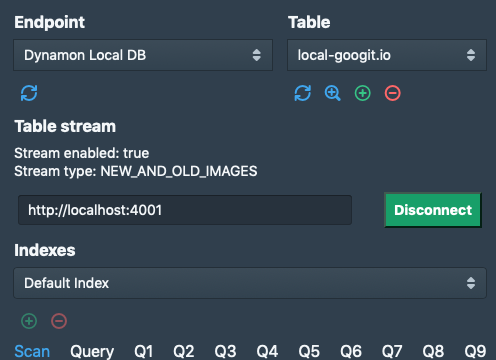

함수형 CSS 를 지향하는 프레임웍이 있다. 전부터 소개를 하고 싶었는데 이를 가지고 프로젝트를 한번 진행해본 후 정말 괜찮다고 생각되면 글을 남기자고 생각을 했는데 그게 오늘이 된 것 같다.

> 부트스트랩을 대체할 CSS 프레임웍은 없나요?

커뮤니티를 돌아다니보면 이런 질문들을 많이 많이 본다. 있다. 대표적으로 Semantic UI 라던가 Foundation 이라던가 뭐 여러가지가 있다.이건 UI의 컨셉의 차이인데 질문이 실제 내용이 이런 것일 수도 있다고 생각된다.

> 너무 프레임워크 티 안나는 그런거 프레임웍은 없나요?

있다. 게다가 매우 자유도도 높고 생각보다 훨씬 성숙한 프레임워크가 있다. 우연이 돌아다니다가 찾게된 이 프레임워크의 이름은,


# Tachyons

`tachyons` 는 함수형을 지향하는 프레임웍이다. CSS에 함수형이라니? 일단 함수형하면 머리속에 떠올려야하는 것들이 있다.

- 함수가 많다.
- 함수는 한가지 일만 한다(단일 책임).
- 함수는 조합된다.

`tachyons` 에 대한 설명을 하기 위해 3가지만 썼다. `tachyons` 이 정확히 그러하다.

최근에 CSS의 모듈화 방식에 대해서만 포커싱이 되는 느낌이 강한데 모듈화는 이 `tachyons` 를 거쳐서 올라가도 될 것 같다. 이 글을 읽고 나면 아마 `styled-component` 와의 조합등이 머리에 떠오르지 않을까 한다. 개인적으로는 안써서 잘 모르겠지만, 느낌상? 🤖

## Overview

일단 관심을 더 끌기 위해서 코드부터 작성해 보겠다.

```tsx
<textarea className="ba bw1 br2 w-100" />
<button className="link dim br1 ph3 pv2 mb2 dib mt2 bw1 b--black">
  댓글 달기
</button>
```

어딜까? 지금 오른쪽 상단에 상단에 보이는 `💬` 버튼을 누르면 바로 확인이 가능 댓글 창이다. `textarea` 가 미세하게 라운딩이 되어 있고 `border` 가 다소 굵은걸 볼 수 있다. 엘리먼트별로 클래스를 설명해 보면 더욱 더 금방 이해가 될 것 같다.

### textarea

`ba bw1 br2 w-100` 4개의 클래스명을 사용하고 있다. 한 줄씩 읽어 보겠다.

- `ba` - border all, 4 방향 모두 `border` 를 주겠다.
- `bw1` - border width, `border` 의 `width` 는 `1` 로 설정
- `br2` - border radius, `radius` 를 `2` 만큼 줘서 약간만 굴린다.
- `w-100` - width, `width` 를 `100%` 줘서 끝까지 꽉차게

간단히 `textarea`  태그에 포함된 4개의 클래스 명을 통해 `border` 주고 그 굵기와 곡선 처리, `width` 처리까지 했다. 보는김에 버튼까지 조금 더 보자.

### button

`link dim br1 ph3 pv2 mb2 dib mt2 bw1 b--black` 좀 많다. 또 하나씩 읽어보겠다.

- `link` - 이 클래스는 유틸성으로 제공되는데 링크들이 가지는 `text-decoration` 을 없애주는 효과를 가지고 있다.
- `dim` - 이 클래스도 유틸성으로 제공되는 특수한 클래스인데 마우스가 `hover` 이벤트를 발생시키면 `dim` 효과를 내준다.
- `br1` - 위에서 본 함수다 `border-radius` 에 매칭된다.
- `ph3 pv2` - `p` 는 `padding` 을 의미한다. `h`, `v` 는 각각 `horizontal`, `vertical` 을 의미한다. 아래줄과 함께 보자.
- `mb2 mt2` - `m` 은 `margin` 이다. 이번엔 `b`, `t` 가 쓰였는데 각각 `bottom` 과 `top` 을 의미한다.
- `bw1` - 위에서 설명했다.
- `b--black` - 처음 등장하는 컬러에 대한 함수다 . `b--` 는 `border-color` 를 나타낸다. `border` 는 검은색으로 처리한다.

다소 이게 타이밍으로 하려니까 조금 길어졌는데 벌써 느끼는 분들이 계실지 모르겠으나 매우 직관적이다. `mb2 mt2` 는 위의 패딩을 보면 알겠지만 `mv2` 로 합쳐질 수 있다. `b`, `t` 가 있으면 당연히 `l`, `r` 이 각각 `left` 와 `right` 로 존재할 것이라는걸 예상할 수 있다.

떄문에 Hot Module Replacer 와 함께 바로바로 적용되는 직관적인 코딩이 가능하다.


## 네이밍의 직관성

위에서도 조금 설명을 했지만 외워지지 않으면 쓰기가 힘들다. 다행이 내가 쓰는 IDE 인 `WebStorm` 에서는 CSS를 읽어서 자동 완성을 지원해주기 때문에 더 편하게 작업할 수 있었다. 아마 vscode 에서도 관련 플러그인이 있을 것으로 생각된다.

몇가지만 알면 지속적으로 정말 빠르게 코딩을 할 수 있다.

`b--balck` 에 대해서 설명을 했었는데 컬러를 나타내는 것은 4가지 패턴이 존재한다. 아니 `black` 과 `white` 의 경우에만 예외적으로 한가지가 더 있어 총 5가지의 패턴이 제공된다.

- `black` - `color: black` 에 매칭되는 구문이다.
- `bg-black`
- `b--black` - 이건 위에서 설명을 했다.
- `hover-black`
- `black-80`, `hover-black-70`, `bg-white-20` - 뒤에 10단위의 숫자가 붙는다.

총 다섯가지 패턴중에 몇 가지는 설명을 안했는데 직관적이기 때문에 따로 설명을 하지 않아도 알 것이라 생가된다. 모르겟으면 문서를 찾아보거나 당장 이 글을 읽고 있는 구깃에서 개발자 도구를 열어서 검색을 해보면 알 수 있다.


## 미리 정의된 컬러와 마진, 각종 사이즈들

`f1` 부터 `f7` 까지 사이즈가 정의되어 있다. `f` 는 `font` 다 모두 `em` 으로 설정되어 있다. `border` 와 `margin`, `padding` 위에서도 이미 등장했듯이 뒤에 숫자를 붙여서 그 정도를 조정한다. 이 숫자에 대한 매칭값은 모두 미리 정의되어 있으며 일반 UI를 작성하는데 무리가 없다. 또한 조합을 갖춘 컬러셋이 정의 되어 그냥 사용하면 된다.


## 모바일 퍼스트

요즘은 다 모바일 퍼스트를 지향한다고 하나 내가 보기에는 훨씬 더 직관 적인 구조를 가지고 있다. 비교없이 `tachyons` 에 대해서만 이야기하면 3가지의 클래스를 제공한다.

- `ns`
- `m`
- `l`

이렇게 3 가지 서픽스를 통해 반응형에서 다르게 보이는 것을 제어한다. 코드로 예를 들어 보겠다.

```tsx
<span className="bg-black-80 white f1 f2-m f3-l">
  Hello, Tachyons!
</span>
```

동일한 레이어의 클래스명이 3개가 쓰였다. `f1 f2-m f3-l` 폰트에서는 숫자가 작을수록 큰 폰트를 보여주는데 먼저 **아무런 서픽스가 없으면 모바일을 포함해 전체에 적용된다.**  여기서 서픽스를 적용하면 특정 사이즈에 대해 다른 제어를 할 수 있다.

여기서는 `middle` 사이즈의 디바이스(작은 타블렛, 폰의 가로모드) 에서는 `f2` 의 폰트를 보여주게된다. `large` 디바이스로 분류 되는 iPad Pro 나 데스크탑에서는 `f3` 의 폰트가 보여지게 된다.

### 그럼 `ns` 는?

**not-small** 을 의미하며 모바일 퍼스트기 때문에 폰이 아닌 다른 디바이스들에 대한 처리에 쓰인다. 즉, `m`, `l` 을 합친것과 같은 효과다.


## 부트스트랩과의 비교

### 부트스트랩

부트스트랩은 기본적으로 컴포넌트를 지향한다. 때문에 클래스명이 컴포넌트로 정의된다. `btn-primary` 이말은 버튼 모양이 정의되어 있다는 의미다. `primary` 생상의 `btn` 버튼을 의미하는데 이를 통해서 빠르게 구현을 해갈 수 있지만 도대체 이 클래스가 어떤 마진과 패팅 라인 하이트를 가지고 구현되며 보더에 라운딩이 들어가는지 자체는 UI 를 본 후에야 확인 할 수 있으며 수정이 어렵다는 단점이 있다. 때문에 초기에 언급했던 그런 질문이 계속적으로 나오는게 아닐까 싶다.

### Tachyons

`tachyons` 는 이를 풀어서 사용하므로써 거의 css 에 1:1로 매칭되는 형태로 사용한다. 때문에 자체 정의한 CSS를 사용하는 것 만큼이나 자유도를 가진다. 그러면서도 꽤나 잘 정의된 마진, 폰트 사이즈, 컬러 셋을 통해 허접하지 않은 UI를 뽑아낼 수 있다.

트레이드 오프로  클래스 명이 길어지는 단점이 당연히 존재하는데 이는 글의 말미에서 좀 더 언급하도록 하겠다.


## 사용시 염두해둬야 할 점

클래스는 단일 책임을 진다. 동일 레이어릘 관장하는 클래스명을 한번에 넣지 말아야 혼돈이 없다. 코드를 보자.

```tsx
<a
  className={cx('pointer grow-large f2 pl1', {
    'pink' : requesting,
    'white': !requesting && !bookmarked,
    'red'  : !requesting && bookmarked,
  })}
>
  link
</a>
```

코드를 보면 컬러를 나타내는 `pink`, `white`, `red` 가 모두 변수로 빠져있다. 컬러가 만약 스트링으로 정의된 부분에 기본값 처럼 들어가거나 하면 우선 순위를 알 수 없게되 디버깅이 어려워진다.


## 정리

구깃은 `tachyons` 위에서 단일 `css` 파일 하나로 작성됬으며 100 라인이 채 되지 않는다. 그 중에서도 40라인 정도는 PDF 지원을 위한 프린팅 클래스 정의를 위해 사용되었다. 그 만큼 탁월하게 정리되어 있어 딱히 추가적인 정의가 필요하지 않았다.

### 실제 사용 하면서 느낀 점들

정말로 깔끔하다. 그리고 문서화가 정말 잘되어 있어 바로바로 참조를 하면서 프론트엔드 작업을 가능하게 한다. 클래스명의 직관성으로 인해 처음에 몇번 문서를 보고나면 나중엔 스스로 그냥 타자가 쳐진다. 게다가 IDE 에서 코드 어시스트까지 지원하니 정말 편하게 작업을 할 수 있었다.

### 사용 방향성

다이나몬은 `blueprintjs` 라는 데스크탑과 매우 흡사한 UI를 제공해주는 프레임웍을 쓰고 있었는데 마진을 컨트롤 하는 것이 꽤나 귀찮았다. 매번 클래스명을 정의하도 귀찮고 결국 마진과 패딩에 대한 이런 일반적인 것들은 항상 문제가 되는데 `tachyons` 이런 원자성에 대한 정의가 모두 되어 있어 기존 프레임웍을 메인으로하고 마진이나 글자 크기등을 컨트롤하는 용도로만 쓰여도 잘 붙었다.



**Disconnect** 버튼이 약간 어색하다. 간만에 코딩을 띄염띄염하다보니 `blueprintjs` 의 컨벤션이 기억이 나지 않아. 그냥 `tachyons` 로 버튼을 붙였다 이외 마진, 레이아웃 영역에서도 `flex` 클래스들이 모두 정의되어 있어 이를 통해 정말 빠르게 스트레스없이 작업할 수 있었다.


회사에서 특히 회사 내부 시스템을 만들어야한다면 디자이너와의 협의를 통해 사이즈와 마진 패딩등을 `tachyons` 를 오버라이딩하는 방식으로 정의 하고 최종적으로 재사용을 위해 `styled-component` 와 같은 시스템을 얹는다면 정말 괜찮을 것 같다는 생각을 해본다.


개인적으로 도움을 많이 받은 프레임웍이라 사용성을 위주로 핵심을 요약해봤다. 글이 좀 길어졌는데 여기서 마무리한다.